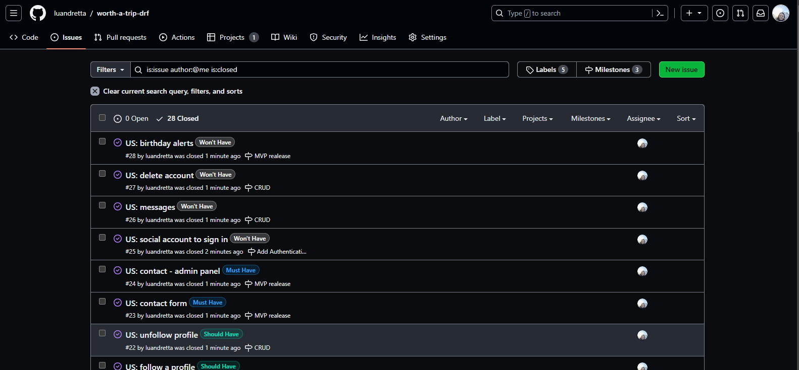

# Worth a Trip

Worth a trip is  a free social networking plattform designed for travel lovers. Users can share  by sharing photo, location, trip type and tips. 
The project's primary objective is to deliver a highly functional and responsive website that empowers users to create and share their posts about lovely places worth a trip effortlessly. Through its comprehensive CRUD functionality, users can easily modify and delete their posts and comments as needed. 

The application is a full-stack project, created using JavaScript, CSS & HTML and built on the React front-end framework using the back-end REST API.

This project was based on the walkthrough project in the Advanced Front End section of the Full Stack Software Development.

Link to deployed site:

- [Worth a Trip - Live](https://worth-a-trip-drf-40e2fa952827.herokuapp.com/)

# Unifying DRF Api and React parts into a unified workspace and deployment

Initially the project had two repositories, for the back-end and the front-end. As recommended by Code Institute, the project was unified and deployed.

Implementing the steps provided should address many of the issues highlighted by previous students, and make debugging the project significantly easier and allowing to work on the project from a single workspace.

Below is a link to the initial front-end repository to check issues and commits 

[Front-end part before unification](https://github.com/luandretta/worth-a-trip-frontend)

This repository will be maintained for assessments of this latest project for the Code Institute.

# User Experience

## Project Goals 

The goal of this project was to build a full featured image sharing service as a social media platform. It has been designed for its users to share their trips and discover exciting places worth a trip.

## Agile

The Agile Tool was used to help to organize and prioritize the tasks using Project Boards on GitHub.

In the first instance a spreadsheet was created to help gather details by theme to later define the epics. Themes: Account Management, Profile, Post Pool, Navigation and Admin.

The issues were created for each User Story, which was then allocated to a milestone (Epic) in Github before the repositories (front-end and back-end) were unified.

[Issues in frontend repo](https://github.com/luandretta/worth-a-trip-frontend/issues?page=1&q=is%3Aissue+is%3Aopen)

A Template for issues was created to speed up the process of adding User Stories to this project. 

* In the repositorie, head over to the settings, then Set Up Templates on the Features. The Issue Template helps to add enough information to the card, so the Developer knoks what are the MVP Points to address.

The MoSCow priorization and customized labels to user stories were used to priorize and implement the features.

* Must Have: guaranteed to be delivered (max 60% of stories)
* Should Have: adds significant value, but not vital ( ~20% of stories)
* Could Have: has small impact if left out (the rest ~20% of stories)
* Won't Have: not a priority for this iteration

The allocation the User Stories to Milestones helps in planning the Sprints. 3 Milestones were created: Minimum Viable Product (MVP) realease, CRUD and Add Authentication and Account functionality.

The Kanban Board, as an agile project management tool, helped to visualize the tasks and limit the work in progress (WIP) by moving cards between the Todo, Backend - DRF, Frontend - React, Test and Done columns.

The Table View was used to sorted the issus according to labels, milestones or status.

## User Stories

### Persona

The target audience for Worth a trip is:
* travel lovers;
* would like to share informations or their thoughts on social media;
* would like to influence people;
* wants to gain hints about trips;
* would like to discover new places to visit.

| Category  | as| I want to | so that I can | UI components  | MoSCow |
| --------- | ------- | -------------- | ---------------------------------- | ------------------ | --------- |
| auth | user| register for an account | have a personal profile with a picture| SignUpForm ProfilePage ProfileEditForm | Must Have |
| auth | user | register for an account  | create, like, bookmarkt and comment on posts | Post PostPage Comment | Must Have |
| auth | user | register for an account | follow anothers users | Profile ProfilePage| Should Have |
| posts | visitor | view a list of posts | browse the most recent uploads | PostsPage  | Must Have |
| posts | visitor | view an individual post | see user feedback, i.e. likes and read comments  | Post PostPage | Should Have |
| posts | visitor | search a list of posts | find a post by title or city or triptype| PostsPage | Should Have |
| posts | visitor | scroll through a list of posts | browse the site more comfortably | InfiniteScrollComponent | Could Have |
| posts | user | create a post  | share my trips with others | PostCreateForm | Must Have |
| posts | user| edit and delete my post | correct or hide any mistakes  | PostEditForm MoreDropdownMenu | Must Have |
| posts | user | view liked and bookmarket posts  | go back often to my favourite and desired posts | PostsPage | Should Have |
| posts | user| view followed users' posts | keep up with my favourite users' trips  | PostsPage  | Should Have |
| posts | user| view saved users' posts | go back often to find inpirations for the next trip  | PostsPage  | Must Have |
| likes | user | like a post  | express my interest in someone's shared trip  | Post like icon   | Must Have |
| likes | user| unlike a post | express that my interest in someone's shared trip has faded away | Post (un) like icon | Must Have |
| wishes | user | save a post  | express my interest in someone's shared trip  | Post pin icon   | Could Have |
| wishes | user| unsave a post | express that my interest in someone's shared trip has faded away | Post (un) pin icon | Could Have |
| comments | user | create a comment  | share my thoughts on other people's content | PostPage CommentCreateForm | Should Have |
| comments | user | edit and delete my comment  | correct or hide any mistakes | PostPage Comment MoreDropdownMenu | Should Have |
| profiles | user | view a profile  | see a user's recent posts, followers, following count data | ProfilePage Post  | Must Have |
| profiles | user | edit a profile | update my profile information | ProfileEditForm  | Must Have |
| followers | user | follow a profile | express my interest in someone's content  | Profile follow button | Could Have |
| followers | user | unfollow a profile | express that my interest in someone's content has faded away and remove their posts from my feed | Profile (un) follow button |  Could Have |
| contact | user | get in touch with the website creator | clear up my doubts | Contact | Must Have |

The User Stories with the MoSCow priorization as "Won't Have" will be listed in the futures implementations.

# Design 

The website was designed with a minimalistic style to align with the site's objectives. The simple design allows users to easily navigate through the site and find what they are looking for.

## Colour Scheme

The design is quite simple.
A light colour scheme is used to ensure that there is a good contrast with the text and to create a clean and visually appealing look across the site. 
The scheme establishes a strong contrast between the background colors and text and, at the same time, ensures that the site meets accessibility requirements. 
Differents shades of gray are used to give more contrast between background and foreground.
The blau and green colors are present in the buttons and icons.
The red color is used to gain attention when user want to delete his post.

| Color         |Hex    |
| ---------- | ------ |
| Blue |  #1B4066 |
| Green |  #116c69|
| Red |  #FF0000 |
| White |  #ffffff |
| Dark gray |  #555555 |
| Gray |  #888 |
| Light gray |  #dadadf |

## Typography

The [Poppins](https://fonts.google.com/specimen/Poppins) was used for the Logo Worth a Trip and header elements. Poppins is one of the Geometric sans serif typefaces have been a popular design tool for building websites. Each letterform is nearly monolinear, with optical corrections applied to stroke joints where necessary to maintain an even typographic color.

The  [Roboto](https://fonts.googleapis.com/css?family=Roboto:300,400,500,700&display=swap) was used for the body text on the site. Roboto is a sans-serif font which allows it to be legible and is a great choice for accessibility.

[Font Awesome](https://fontawesome.com/icons/) icons were used throughout the site.

## Imagery

* Pictures were dowloaded from [Pexels](https://www.pexels.com/) and edited at [Canva](https://www.canva.com/)

## Wireframes

Wireframes were created for mobile, tablet and desktop using [Balsamiq](https://balsamiq.com/).

| Page | Desktop | Tablet | Mobile |
| --- | --- | --- | --- |
| Home not logged in |  | |  |
| Home logged in |  | |  |
| Sign in, Sing up Pages |  | |  |

# Features

## Pages

## Future implementations

## Accessibility

## Detailed page and component breakdown:

**Components map**

## Most reused components

- PostsPage:
  - Home, Feed, Liked
- Post:
  - PostsPage
- Profile:
  - PopularProfiles, PopularProfiles (mobile)
- DropdownMenus:
  - Post, ProfilePage, Comment
- InfiniteScrollComponent:
  - PostPage (loading Comment components)
  - PostsPage (loading all, feed, liked or saved Post components)
  - ProfilePage (loading Post components that belong to the profile)

  ## Libraries, contexts and hooks:

- react-infinite-scroll-component
  - introduced to replace traditional pagination with lazy loading instead of pagination to make the application more performant and seem more snappy/ engaging
- react-bootstrap:
  - introduced
- contexts:
  - CurrentUserContext exposes the user state to the entire app. Relevant components can subscribe to its changes
  - ProfileDataContext exposes the profile state to the entire app. Enables the PopularProfiles component to be in sync with the ProfilePage contents
- custom hooks written to reduce repeatable state logic:
  - useClickOutsideToggle: enable toggle on the burger menu
  - useRedirect: enable redirect for users who are either logged in or logged out, depending on the use case

## Data Models

- Profile

- Posts

The model will give the users the ability to store posts in the database and the serializer will convert and validate the model instances. It'll also add fields that are not stored in the database.

- Wishes

## API Endpoints

## Frameworks, libraries and dependencies

- Django Rest Framework

A powerful and flexible toolkit for building Web APIs, that offers Authentication policies including packages for OAuth1a and OAuth2 and serialization that supports both ORM and non-ORM data sources.

- Signals

Signals allow certain senders to notify a set of receivers that some action has taken place. They’re especially useful when many pieces of code may be interested in the same events.

- Serializers

Serializers allow complex data such as querysets and model instances to be converted to native Python datatypes that can then be easily rendered into JSON, XML or other content types

- Coverage

Coverage.py is a tool for measuring code coverage of Python programs. It monitors your program, noting which parts of the code have been executed, then analyzes the source to identify code that could have been executed but was not. Coverage measurement is typically used to gauge the effectiveness of tests. It can show which parts of your code are being exercised by tests, and which are not.

- React Bootstrap 

The most popular front-end framework, as one of the oldest React libraries, React-Bootstrap has evolved and grown alongside React, making it an excellent choice as the UI foundation. Each component is implemented with accessibility in mind. The result is a set of accessible-by-default components.

- React Router 
To control what the user sees depending on the URL they have accessed in the browser.

- Axios
To tell the React project to send requests to the API 

- Mock Service Worker
To create mock endpoints needed to test NavBar component

- Dayjs
To format dates in React

- Django-countries 7.5.1
Provides country choices for use with forms, flag icons static files, and a country field for models.

- Rating

- Select

## Deployment steps
- add prebuild script
- add Procfile
- remove all console.logs
- use Bootstrap default imports to minimize the build
- deploy to Heroku

## Credits

### Source

- [Django Rest Framework](https://www.django-rest-framework.org/api-guide/serializers)
- [React Bootstrap](https://react-bootstrap.netlify.app/docs/components/navbar/#text-and-non-nav-links)
- [How to reset Django Database](https://stackoverflow.com/questions/66733285/how-to-reset-django-database)
- [Ultimate Guide: How to Format Date in React](https://reacthustle.com/blog/react-format-date-ultimate-guide)
- [Testing Library - React Router](https://testing-library.com/docs/example-react-router/)
- [Appearance and Disappearance - Asserting elements are not present](https://testing-library.com/docs/guide-disappearance/)
- [Django-countries](https://pypi.org/project/django-countries/#single-field-customization)
- [How to show API data on React-Select](https://stackoverflow.com/questions/74238883/how-to-show-api-data-on-react-select)
- [React Select](https://coderszine.com/react-select-dropdown-list-from-api/)
- [Submit Form Data To REST API In A React App](https://www.techomoro.com/submit-a-form-data-to-rest-api-in-a-react-app/)
- [Django-countries Rest output format](https://github.com/SmileyChris/django-countries/#rest-output-format)
- [Django humanize](https://docs.djangoproject.com/en/4.2/ref/contrib/humanize/)
- [Django humanize outside of template](https://stackoverflow.com/questions/17226779/django-humanize-outside-of-template)
- [MDB](https://mdbootstrap.com/docs/react/utilities/spacing/)
- [React Native Email Validation](https://www.abstractapi.com/guides/react-native-email-validation)
- [npm ERR! Conflicting peer dependency](https://stackoverflow.com/questions/72976149/npm-err-conflicting-peer-dependency-react18-0-0)
- [React Best Practices](https://www.freecodecamp.org/news/best-practices-for-react/)
- [How to add infinite scroll to a React js and Django Rest Framework project](https://www.youtube.com/watch?v=bFKBu917kw8)

