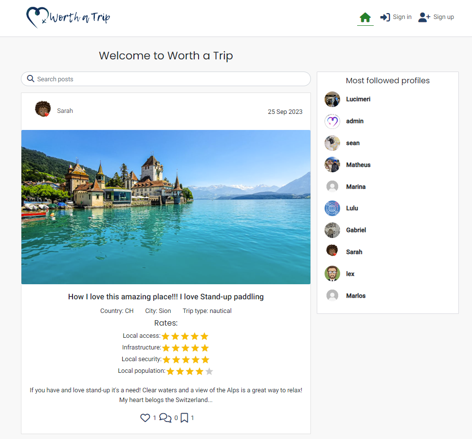

# Worth a Trip

Worth a trip is  a free social networking plattform designed for travel lovers. Users can share lovely places worth a trip by posting photo, location and tips.

This application provides the necessary backend and API functionality, to be consumed by the React frontend application.
The User Experience (Agile Methodology, User Stories, Wireframes, Design), Testing, Bugs and Credits are in the frontend repository.
Links to the Frontend:
- [Repository](https://github.com/luandretta/worth-a-trip-frontend)
- [Live]()

Link to deployed site: [Worth a Trip](https://.herokuapp.com/)

## Data Models

## API Endpoints

## Frameworks, libraries and dependencies

