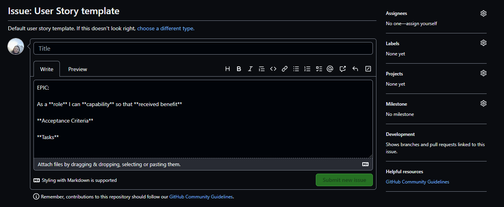
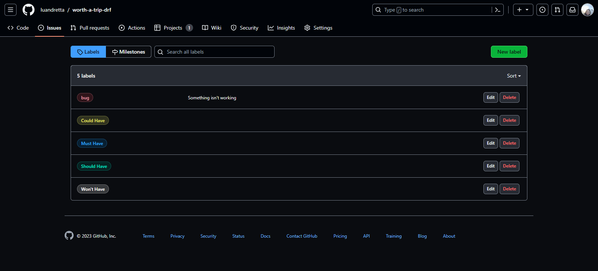
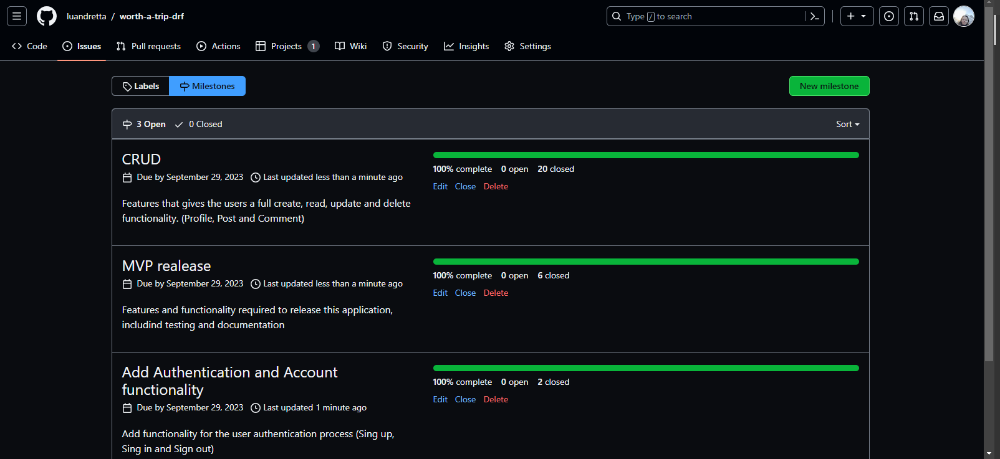
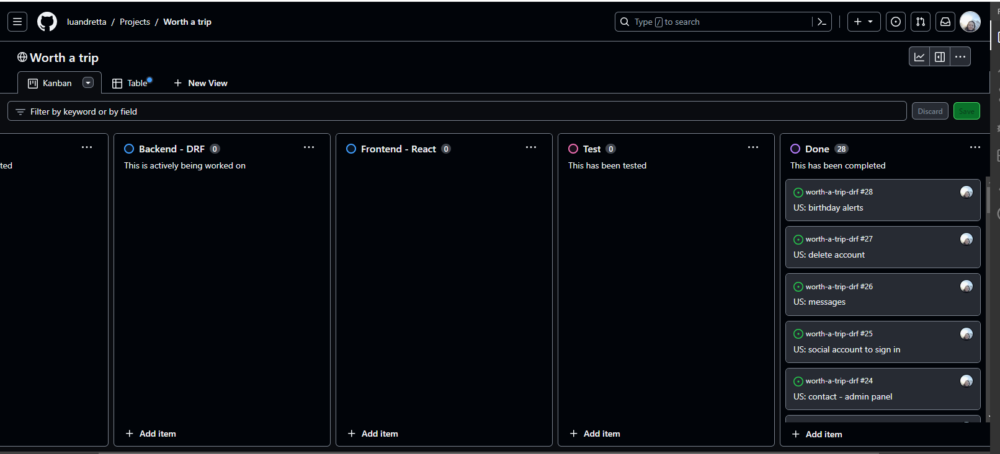
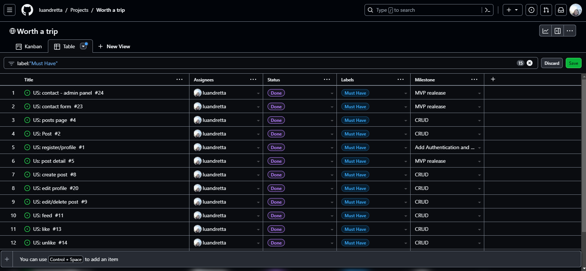
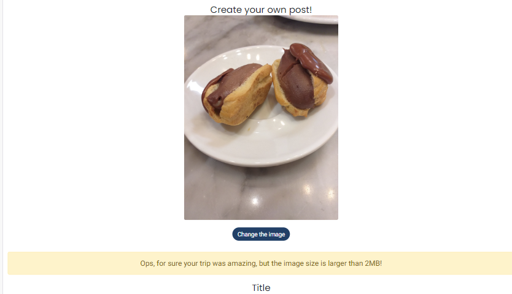
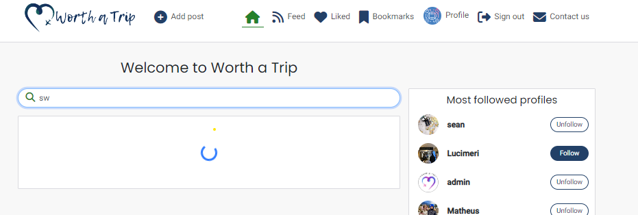
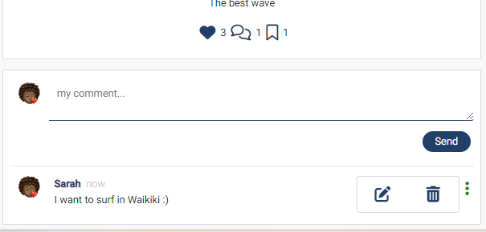
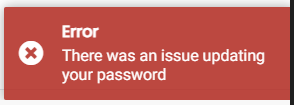

# ✈️ Worth a Trip


Worth a trip is  a free social networking plattform designed for travel lovers. Users can share  by sharing photo, location, trip type and tips. 
The project's primary objective is to deliver a highly functional and responsive website that empowers users to create and share their posts about lovely places worth a trip effortlessly. Through its comprehensive CRUD functionality, users can easily modify and delete their posts and comments as needed. 

The application is a full-stack project, created using JavaScript, CSS & HTML and built on the React front-end framework using the back-end REST API.

This project was based on the walkthrough project in the Advanced Front End section of the Full Stack Software Development.

Link to deployed site:

- [Worth a Trip - Live](https://worth-a-trip-drf-40e2fa952827.herokuapp.com/)


# 📃 Unifying DRF Api and React parts into a unified workspace and deployment

Initially the project had two repositories, for the back-end and the front-end. As recommended by Code Institute, the project was unified and deployed.

Implementing the steps provided should address many of the issues highlighted by previous students, and make debugging the project significantly easier and allowing to work on the project from a single workspace.

Below is a link to the initial front-end repository to check issues and commits 

[Front-end part before unification](https://github.com/luandretta/worth-a-trip-frontend)

This repository will be maintained for assessments of this latest project for the Code Institute.

# 📌 User Experience

## Project Goals 

The goal of this project was to build a full featured image sharing service as a social media platform. It has been designed for its users to share their trips and discover exciting places worth a trip.


## Agile

The Agile Tool was used to help to organize and prioritize the tasks using Project Boards on GitHub.

The issues were created for each User Story, which was then allocated to a milestone and labels are added.


A Template for issues was created to speed up the process of adding User Stories to this project.



* In the repositorie, head over to the settings, then Set Up Templates on the Features. The Issue Template helps to add enough information to the card, so the Developer knoks what are the MVP Points to address.


The MoSCow priorization and customized labels to user stories were used to priorize and implement the features.


* Must Have: guaranteed to be delivered (max 60% of stories)
* Should Have: adds significant value, but not vital ( ~20% of stories)
* Could Have: has small impact if left out (the rest ~20% of stories)
* Won't Have: not a priority for this iteration



The allocation the User Stories to Milestones helps in planning the Sprints. 3 Milestones were created: Minimum Viable Product (MVP) realease, CRUD and Add Authentication and Account functionality.



The Kanban Board, as an agile project management tool, helped to visualize the tasks and limit the work in progress (WIP) by moving cards between the Todo, Backend - DRF, Frontend - React, Test and Done columns.



The Table View was used to sorted the issus according to labels, milestones or status.



## User Stories

### Persona

The target audience for Worth a Trip is:
* travel lovers;
* would like to share informations or their thoughts on social media;
* would like to influence people;
* wants to gain hints about trips;
* would like to discover new places to visit.


| Category  | as| I want to | so that I can | UI components  | MoSCow |
| --------- | ------- | -------------- | -----------------------  | ---------| --------- |
| auth | user| register for an account | have a personal profile with a picture| SignUpForm<br>SignInForm<br>ProfilePage<br>ProfileEditForm | Must Have |
| auth | user | register for an account  | create, like, bookmarkt and comment on posts | Post<br>PostCreateForm<br>PostPage<br>Comment | Must Have |
| auth | user | register for an account | follow anothers users | Profile<br>ProfilePage<br>PopularProfiles| Should Have |
| posts | visitor | view a list of posts | browse the most recent uploads | PostsPage  | Must Have |
| posts | visitor | view an individual post | see user feedback, i.e. likes and read comments  | Post<br>PostPage | Should Have |
| posts | visitor | search a list of posts | find a post by title or city or triptype| PostsPage | Should Have |
| posts | visitor | scroll through a list of posts | browse the site more comfortably | InfiniteScroll  | Could Have |
| posts | user | create a post  | share my trips with others | PostCreateForm | Must Have |
| posts | user| edit and delete my post | correct or hide any mistakes  | PostEditForm<br>MoreDropdownMenu<br>PostDelete | Must Have |
| posts | user | view liked posts  | go back often to my favourite posts | PostsPage | Should Have |
| posts | user| view followed users' posts | keep up with my favourite users' trips  | PostsPage  | Must Have |
| posts | user| view saved users' posts | go back often to find inpirations for the next trip  | PostsPage  | Should Have |
| likes | user | like a post  | express my interest in someone's shared trip  | Post like icon   | Must Have |
| likes | user| unlike a post | express that my interest in someone's shared trip has faded away | Post (un) like icon | Must Have |
| wishes | user | save a post  | express my interest in someone's shared trip  | Post bookmark icon   | Could Have |
| wishes | user| unsave a post | express that my interest in someone's shared trip has faded away | Post (un) bookmark icon | Could Have |
| comments | user | create a comment  | share my thoughts on other people's content | PostPage<br>CommentCreateForm | Must Have |
| comments | user | edit and delete my comment  | correct or hide any mistakes | PostPage<br>Comment<br>MoreDropdownMenu | Must Have |
| profiles | user | view a profile  | see a user's recent posts; followers, following count data | ProfilePage<br>Post<br>Follow/Unfollow Button  | Must Have |
| profiles | user | edit a profile | update my profile information | ProfileEditForm  | Must Have |
| followers | user | follow a profile | express my interest in someone's content  | Profile follow button | Should Have |
| followers | user | unfollow a profile | express that my interest in someone's content has faded away and remove their posts from my feed | Profile (un) follow button |  Should Have |
| contact | user | get in touch with the website creator | clear up my doubts | Contact Form| Must Have |
| contact | admin | receive messages from users | answer their questions | Admin Panel | Must Have |

The User Stories with the MoSCow priorization as "Won't Have" are be listed separate and are not implemented:

| Category  | as| I want to | so that I can | UI components  | 
| --------- | ------- | -------------- | -----------------------  | ---------|
| register | user | register for an account by using one of my social media accounts | use an alternative method of signin up | Sing Up Form |
| messages | user | send and receive messages | get in touch with others users privately | Message | 
| register | user | delete my account | remove myself from the app | ProfileDeleteForm |
| profiles | user | receives birthday alerts for my connections | send a personalized birthday comment | Notification |

- - - 

# 🎨 Design 

The website was designed with a minimalistic style to align with the site's objectives. The simple design allows users to easily navigate through the site and find what they are looking for.

## Colour Scheme

The design is quite simple.
The colour scheme is used to ensure that there is a good contrast with the text and to create a clean and visually appealing look across the site. 
The scheme establishes a strong contrast between the background colors and text and, at the same time, ensures that the site meets accessibility requirements. 
Differents shades of gray are used to give more contrast between background and foreground.
The blau and green colors are present in the buttons and icons.
The red color is used to gain attention when user want to delete his post.

| Color         |Hex    |
| ---------- | ------ |
| Blue |  #1B4066 |
| Green |  #018031|
| Red |  #FF0000 |
| White |  #ffffff |
| Dark gray |  #555555 |
| Gray |  #888 |
| Light gray |  #dadadf |

## Typography

The Lemon Tuesday Handwritten Font is a handmade experiment font made with ink and parallel pen. perfect for the logo to gain attention. It was created by designers who have drawn these fonts and then allowed everyone to use, share, change and improve the fonts, free of charge.

 

The [Poppins](https://fonts.google.com/specimen/Poppins) was used for header elements. Poppins is one of the Geometric sans serif typefaces have been a popular design tool for building websites. Each letterform is nearly monolinear, with optical corrections applied to stroke joints where necessary to maintain an even typographic color.


The  [Roboto](https://fonts.googleapis.com/css?family=Roboto:300,400,500,700&display=swap) was used for the body text on the site. Roboto is a sans-serif font which allows it to be legible and is a great choice for accessibility.


[Font Awesome](https://fontawesome.com/icons/) icons were used throughout the site.

## Imagery

* Pictures were dowloaded from [Pexels](https://www.pexels.com/) and edited at [Canva](https://www.canva.com/)

## Wireframes
Wireframes were created for mobile and desktop using [Balsamiq](https://balsamiq.com/). 


| Page | Desktop |  Mobile |
| --- | --- | --- | 
| Home not logged in |  |  |
| Home logged in |  |  |
| Sign in, Sing up Pages |  |  |
| Post Page |  |  |
| Post Create/Edit Form |  |  |
| Post Delete |  |  |
| Profile|  |  |
| Profile Edit |  |  |
| Contact |  |  |


# ⚙️ Features

Scope of functionalities

## Header

### Logo

The logo is prominently positioned in the top-left corner of the navigation bar. It is linked to the homepage to make it easy for users to navigate back to the main page of the website.


### Navigation Bar

The navigation bar is present on all pages of the website and allows for easy navigation. The Navbar includes a logo and links to various pages. The links on the Navbar will change depending on whether the user is logged into their account or not.


#### Navbar - not logged in

- There is two links either Sign in or Sign up.


#### Navbar - logged in

- If a user is logged in, their profile avatar will be displayed in the navigation bar


- Due to responsiveness, a hamburger menu is used.


## Home Page 

The homepage offers a variety of features for both logged-in and logged-out users, including the search functionality which allows visitors and users to search for posts and profiles. 
The visitors can read the content of the website, but cannot interact as an user, so that they can taste the application a little bit and sign up consciously.

All posts are present in this page and the user. The logged in user can like, bookmark and comment posts and follow or unfollow anothers users.


**Home Page for visitors**


**Home Page for users**


## Sign Up Page


## Sign In Page


## Sign Out 

When the user clicks on the sign-out link in the navigation bar, a pop-up sign-out modal appears, providing users with a clear confirmation option to sign out of their account. This feature ensures a smooth and secure user experience, enhancing the usability of the application.


## Add Post

By accessing the 'Add Post' link located in the navigation bar, users can easily create a new post.
The user need to upload an image, type a title and city, choose the country and trip type, rate the trip and can share more informations.


If the image size is larger than 2MB the post won't be created due to the image filter in the backend and will display a message.



## Post Detail Page

By clicking on a post, the user will see the post in detail on the Post Page, and can comment if they are logged in. If the logged-in user is the owner of the post, they will have the option to edit or delete the post by the presence of a menu which consists of an edit and delete icon.


## Edit Post Page

Clicking on the edit icon for a post will display the post with the prepopulated data, allowing users to easily make edits and updates to their content.


## Post Delete 

By clicking on the delete icon in the Post dropdown menu, users will be redirected to Post Delete Page to confirm the deletion their posts from the database, so that they don't delete their posts accidentally. 


## Search Functionality

- To improve the user experience, a loading spinner appears while the user is typing their search query. 



- The results:


- If no search results are found, an image accompanied by the text 'No results found' is displayed to help users quickly understand the outcome of their search.


## Comments

The comments section on a post detail page is accessible to both logged-in and logged-out users. However, to create a comment, users must be signed in, as the comment input field is only displayed to authenticated users. This ensures a secure and efficient commenting process for users.
The comment owner can update and delete it through the implementation of the Post dropdown menu component. By clicking on the edit icon, the comment data is automatically prepopulated, making the editing process seamless and efficient.
The post has a comment count.

- Logged in user


- Comment More Dropdown Menu



- Comment Edit


- No Comments yet


- Logged out - visitor cannot comment the post


## Feed Page, Liked and Bookmarks Pages

The three pages have the same styling as Home as it uses the Post component and are only filtered. The users cannot like or bookmark their own posts or follow themselves.

- Feed Page: a user's feed will compose of posts which the user is following.


If the user are not following anyone displays a message.


- Liked Page: displays a user's collection of liked posts, easily identified by a heart icon on the post component.


- If the user hasn't liked any posts yet a message will appear.


- Bookmarks Page: displays a user's collection of bookmarked posts, easily identified by a bookmark icon on the post component.


- If the user has not yet marked a post, a message will be displayed.


## Profile Page

The profile contains the user's information including name, profile picture, background picture, bio, location, birth date, number of followers and owns posts. 
If the user doesn't upload a profile or background picture his profile has default pictures.

If the users are viewing their own profile then they'll have a dropdown menu to edit their profile, change username or change password. If they're viewing another user's profile then they'll have a button to follow or unfollow that user. This functionality has been thoroughly tested to ensure that the counts accurately increment and decrement in response to various user actions, such as following a user or adding a new post.

The user's posts are displayed below their personal information using the `Post.js` component. 

The date of birth was edited using `dayjs` library.


- If the user has not uploaded any posts, a message and image stating *No posts yet* will be displayed, providing the user with feedback and encouraging them to create posts.


- The information that has not been edited (empty data) won't be displayed using React Conditional Rendering. 


## Edit Profile Page

The user can customize your own profile. The Edit Profile Page comes with prepopulated data, making it easier for users to quickly update their profile information without having to re-enter existing data. The empty data won't be displayed.

- Menu


- Inputs


- Edited


## Change Username

The Change Username functionality comes prepopulated with the user's current username. The username is unique and if the user tries to change their username to an existing one, a notification and an error message will be displayed.

- Menu


- Input 


- Attempt to change username to an existing one


- Success message


## Change Password

To enhance the security of users' accounts, the application provides an option for users to change their password, giving them greater control over the protection of their personal information. The user need to type the new password and confirm the new password to avoid mistakes.

- Menu


- Input 


- Attempt to change password with differents passwords


- Success message


## Contact Page

The Contact Page provides users with the option to send a message to the backend API. As a future improvement, a dropdown menu can be added to allow users to select the type of inquiry they wish to make, making the process more streamlined and efficient. A notification pop-up feature has also been added to let the user know that their message has been received.

- Attempt to send empty form.


- Contact Form


- The backend receives the message from Contact Form.


## 404 Error Page

A custom 404 Error Page has been implemented to improve the user experience in cases where the user enters an incorrect URL. This page provides a clear and easy-to-use message, guiding the user back to the site's home page via a button or Navbar.


## Notifications

React Notifications have been used in the app to enhance the user experience by providing real-time feedback and alerts to the user. The users are immediately notified of any changes or actions taken within the app, such as successful logins, errors or notifications for removing content. 





*** 

## 🧠 Future implementations 

Besides the features were registered as Won't Have in the MoSCoW prioritization in the User Stories, the future implementations I would like to implement:

* Prepopulate the login fields after a user registers on the site and is redirected to the login page - this is good UX as we shouldn't expect a user to fill in the form with information we already have.
* Filter for trip type
* Buildin Photo Picker and Editor
* Business Profile
* Advertisements
* App for smartphones
* Events page
* Groups
* Ability for users to log in via social networks such as Google or Facebook
* Ability to delete own account
* Notifications when other user like or bookmark your post 
* Notifications when another user start to follow you
* Pages to display all users, followers and following profiles
* Birthday reminders for followed users

## 🗣️ Accessibility

I have been mindful during coding to ensure that the website is as accessible friendly as possible. This has been have achieved by:

* Using semantic.
* Using descriptive alt attributes on images on the site.
* Providing information for screen readers where there are icons used and no text.
* Ensuring that there is a sufficient colour contrast throughout the site.

## 🔒 Security Features and Defensive Design

### `useRedirect`

`useRedirect` listens for changes in the user's authentication status. When there's a change, it tries to refresh the users authentication token. Depending on if thats a success or failure and the passed userAuthStatus, it redirects the user to the main route, which is the posts list.

### Form Validation

A warning message will appear to the user when inaccurate or empty data is entered into a form, identifying the specific field that caused the issue. This prevents the form from being submitted until the issue is resolved, ensuring that only accurate and complete data is processed.

### Permissions

Greater control of user activity through permissions on the views of each app in the backend ensures a defensive programming as well.

## ✔️ Detailed page and component breakdown


## Components

A number of reusable React components were created with the intention of reducing code duplication.

### `Asset.js`

The `Asset.js` is a versatile and reusable component that is used to render the loading spinner utilised throughout the app. It accepts a small prop which a parent component can use to request a smaller spinner. With customizable props such as spinner, src, and message, the component can be easily adapted to suit different use cases and design requirements. 
To ensure the maximum accessibility for spinner components the Spinner component has the relevant ARIA role property, and include screenreader-only readable text representation of the spinner's meaning inside the component using Bootstrap's visually-hidden class.

### `Avatar.js`

The `Avatar.js`component is designed to display user avatars with a high degree of flexibility and reusability. Separating the avatar display from other components and pages enables more efficient code organization and easier maintenance. With customizable height and an optional text overlay, the Avatar component can adapt to different page designs and layouts, allowing for seamless integration into different parts of the site. 


### `MoreDropdown.js` 

The `MoreDropdown.js` component  provides a dropdown menu represented by the three dots (`...`), visible on any content, where a user respectively the owner of an object, can edit it. It contains two main actions: "Edit" and "Delete". When clicked, each respective action is taken.

- ThreeDots: This is a custom toggle for the dropdown menu. The use of `React.forwardRef` ensures that the dropdown gets access to the DOM for positioning.

- Dropdown Toggle: It uses the ThreeDots component as the toggle button for the dropdown.

- Dropdown Menu: This contains two items:

  - Edit: Represented by a pencil icon, when clicked, it triggers the `handleEdit` function.
  - Delete: Represented by a trash can icon, when clicked, it trigggers the `handleDelete` function.

**Profile Edit Dropdown**

The `ProfileEditDropdown` is a similar dropdown like the MoreDropdown but specifically for the profile actions. Instead of general actions like the MoreDropdown, it contains three actions that relate are used in the profile section: "Edit Profile", "Change Username", and "Change Password".

- Dropdown Menu: This contains three items:
 - Edit Profile: Navigates the user to the profile edit page.
 - Change Username: Navigates the user to the username change page.
 - Change Password: Navigates the user to the password change page.

The component uses the `useHistory` hook to handle navigation for each dropdown action.

The styling is handled by the MoreDropdown.module.css file.

### React Infinite Scroll 

Introduced to replace traditional pagination with lazy loading instead of pagination to make the application more performant and seem more snappy/ engaging.
This feature works by loading new content into the webpage when the user reaches the bottom of the page, without requiring the user to manually click a *Load More* button.  This feature provides a seamless user experience, as the user can easily browse through a large amount of content without interruptions or delays.

### `Post.js` 

The Post component receives several props that contain information about a post. The component also uses the useCurrentUser hook from a custom context called CurrentUserContext to retrieve the current user. The Post component renders information about the post including its owner, title, image, ratings and the number of comments, likes, and wishes. It also renders the `Avatar.js` component and the `PostDropdownBar.js` component which is only displayed if the current user is the owner of the post and is viewing it on the post detail page. The Post component contains several functions that handle different events like deleting a post, editing a post, liking a post, unliking a post, bookmark a post, and remove the bookmark. These functions make API calls using axiosRes. When the user likes or unlikes a post or pin or remove the pin from the post, the Post component updates the posts state by calling the setPosts function passed down as a prop to the component. It updates the  properties of the post object in the posts state. This component is used to display posts on the *'Feed'*, *'Desired'* and *'Liked'* pages. The handle edit and delete redirect to their pages.

### `PostDelete.js`

The Post Delete component was created so that the owner doesn't delete a post object unintentionally. The user needs to click on the button to confirm deletion or cancel and go back using `useHistory`hook to handle navigation history.

### `NotFound.js`

The NotFound component is used to inform users that the page they're trying to access doesn't exist or cannot be found. This component provides a user-friendly response to potential navigation errors or mistyped URLs. It reuses the `Asset` component to display a messsage and an image.

### `ErrorModal.js`

The ErrorModal component serves as a notification system for displaying error messages to the user using the try catch blocks and will be implemented in the future.

## Most reused components

- PostsPage:
  - Home, Feed, Liked, Bookmarks
- Post:
  - PostsPage
- Profile:
  - PopularProfiles, PopularProfiles (mobile)
- DropdownMenus:
  - Post, ProfilePage, Comment
- InfiniteScrollComponent:
  - PostPage (loading Comment components)
  - PostsPage (loading all, feed, liked or bookmarked Post components)
  - ProfilePage (loading Post components that belong to the profile)


## Contexts

### CurrentUserContext 

The CurrentUserContext exposes the user state to the entire app. Relevant components can subscribe to its changes.

### ProfileDataContext

ProfileDataContext exposes the profile state to the entire app. Enables the PopularProfiles component to be in sync with the ProfilePage contents

## Hooks

Custom hooks written to reduce repeatable state logic.

### `useClickOutsideToggle`

The custom hook useClickOutsideToggle enables togglng on the burger menu in the `NavigationBar.js`. When the user clicks on the menu, it toggles the expanded state using the setExpanded function. The expanded value is then used to conditionally render the menu items. When the user clicks outside of the menu, the `useOutsideClickToggle` hook automatically updates the expanded state to false, hiding the menu.

### `useRedirect`

The useRedirect hook enables redirect for users who are either logged in or logged out, depending on the use case. It uses  the React Router and Axios libraries to handle navigation and API requests.


## Database Schema & User Journey

#### User Journey


#### Database Schema

* **Diagram**

An entity relationship diagram was created to help the visualization the relationships of the data structures and mapped it out.


* **Models**

Models created for this application:

-  Djando User Model 

The Django authentication system handles both authentication and authorization. Briefly, authentication verifies a user is who they claim to be, and authorization determines what an authenticated user is allowed to do. Here the term authentication is used to refer to both tasks.


- Profiles

The Profiles model has a unique one-to-one relationship with the User model, meaning that each registered user on the website will have a corresponding Profile model. This allows for additional values to be defined relative to the user, such as an  background picture, profile picture, bio, birth date and location. The Profile model serves as a convenient extension to the User model, providing an efficient way to store and access user-specific information.

| Database Value | FieldType |
| ----| ---- | 
| owner | OneToOneField  | 
| name | CharField   |  
| bio | TextField   |  
| profile_pic | ImageField |  
| bg_pic |  ImageField  |
| birth_date | DateField |
| location | CharField |
| created_at | DateTimeField |
| updated_at | DateTimeField |


- Posts

The model will give the users the ability to store posts in the database and the serializer will convert and validate the model instances. The owner field is a OneToOneField that establishes a relationship with the User model, specifying that each post can only have one owner.
The image field is an ImageField that accepts image files and stores them in the 'images/' directory, as specified by the 'upload_to' parameter. If no image is provided, a default image  will be used, which can be changed as needed.

| Database Value | FieldType | 
| ----| ---- | 
| owner | ForeignKey(User) |  
| title | CharField |  
| country |  CountryField  |  
| location |  CharField  |  
| content |  TextField  | 
| image | ImageField | 
| trip_type | CharField (choices)
| local_security | IntegerField |
| infrastructure | IntegerField |
| local_population | IntegerField |
| local_access| IntegerField |
| created_at | DateTimeField |
| updated_at | DateTimeField |


- Comments

The Comment Model allows user to create a comment on a post. If a comment is deleted, it is deleted from both the User and post models.

| Database Value | FieldType | 
| ----| ---- | 
| owner | ForeignKey(User) | 
| post |  ForeignKey(Post)  |  
| contentt |  TextField  | 
| created_at | DateTimeField |
| updated_at | DateTimeField | 


- Likes

The owner field is a ForeignKey that creates a relationship between the Like model and the User model, indicating that each Like instance belongs to one user.

| Database Value | FieldType |
| ----| ---- | 
| owner | ForeignKey(User) | 
| post |  ForeignKey(Post, related_name='likes')  |
| created_at | DateTimeField |
 

- Wishes

The Wishes model is defined by three fields that establish a many-to-one relationship between users and posts. Together, these fields allow users to bookmark specific posts on the website for easy reference at a later date.

| Database Value | FieldType |
| ----| ---- | 
| owner | ForeignKey(User) | 
| post |  ForeignKey(Post, related_name='wishes')  |
| created_at | DateTimeField |


- Followers

The owner field is a ForeignKey that creates a relationship between the Follow model and the User model, indicating that each Follow instance belongs to one user.

| Database Value | FieldType |
| ----| ---- |  
| owner | ForeignKey(User, related_name='following') | 
| followed | ForeignKey(User, related_name='followed') |
| created_at | DateTimeField |

- Contact
The Contact model in Django is defined by several fields that establish a many-to-one relationship between users and messages. These fields allow users to send messages to the website administrator and provides a reliable and efficient way to manage user feedback and communication. 

| Database Value | FieldType |
| ----| ---- |
| owner | ForeignKey(User) | 
| subject | Charfield   |
| message |  TextField  |
| created_at | DateTimeField |
| updated_at | DateTimeField |


## API Endpoints

The following list will give a brief overview of the avaliable API endpoints.

* Django Rest Auth

| URL | http | data sent | data received |
| --- | ---- | ----| ---- |
| dj-rest-auth/registration/ | POST | username<br>password1<br>password2 | - |
| dj-rest-auth/login/ | POST | username <br>password | access token <br> refresh token |
| dj-rest-auth/logout/  | POST | - | - |
| dj-rest-auth/user/ | GET | access token <br> refresh token | username <br> profile_id <br>profile_pic |
|  dj-rest-auth/token/refresh/ | POST | access token <br> refresh token | (new) <br> access token |

* Admin

| URL | http |
| --- | ---- |
| /admin | django built in admin url |

* Others Endpoints 

| URL | http | CRUD operation | view name |
| --- | ---- | ----| ---- |
| /profiles  | GET <br> POST | list all profiles <br>create a profile | LIST |
| /profiles/:id | GET <br> PUT | retrieve a profile by id <br>update a profile by id| DETAIL |
| /followers  | GET <br> POST | list all followers <br>follow a profile | LIST |
| /followers/:id | GET <br>DELETE| retrive a follower by id <br>delete a follower by id| DETAIL |
| /posts  | GET <br> POST | list all posts <br>create a post | LIST |
| /posts/:id | GET <br> PUT <br>DELETE| retrieve a post by id <br>update a post by id<br>delete a post by id| DETAIL |
| /comments  | GET <br> POST | list all comments <br>create a comment | LIST |
| /comments/:id | GET <br> PUT <br>DELETE| retrive a comment by id <br>update a comment by id<br>delete a comment by id| DETAIL |
| /likes  | GET <br> POST | list all likes <br>create a like | LIST |
| /likes/:id | GET <br> DELETE| retrive a comment by id <br>delete a comment by id| DETAIL |
| /wishes  | GET <br> POST | list all wishes <br>create a wish | LIST |
| /wishes/:id | GET <br> DELETE| retrive a wish by id <br>delete a wish by id| DETAIL |
| /contact | GET <br> POST | list all contacts <br>create a contact | LIST |
| /contact/:id | GET <br> DELETE| retrive a contact by id <br>delete a contact by id| DETAIL |


##  ⛑ Programs Used 


[Pip](https://pypi.org/project/pip/) - Tool for installing python packages.

[Balsamiq](https://balsamiq.com/) - Used to create wireframes.

[Git](https://git-scm.com/) - For version control.

[Github](https://github.com/) - To save and store the files for the website.

[Gitpod](https://gitpod.io/workspaces) - Cloud-based IDE for development.

[Heroku](https://git-scm.com/) -  Hosting the deployed back-end site.

[Google Fonts](https://fonts.google.com/) - To import the fonts used on the website.

[Canva](https://canva.com/) - To create logo and images.

[Pixlr](https://pixlr.com/x/) - Pixlr was used to resize and remove the background color from logo.

[Google Chrome Tools](https://developer.chrome.com/docs/devtools/) - To troubleshoot and test features, solve issues with responsiveness and styling.

[Am I Responsive?](http://ami.responsivedesign.is/) To show the website image on a range of devices.

[Shields.io](https://shields.io/) To add badges to the README.

[W3C Markup Validator](https://validator.w3.org/)

[JSHint Validator](https://jshint.com/)

[Draw.io](https://app.diagrams.net/) Free online diagram software


## Frameworks, libraries and dependencies

- Django Rest Framework

A powerful and flexible toolkit for building Web APIs, that offers Authentication policies including packages for OAuth1a and OAuth2 and serialization that supports both ORM and non-ORM data sources.

- Django Rest Auth

Provides a set of REST API endpoints for Authentication and Registration

- React Framework

React allows you to build user interfaces out of individual pieces called components. React components are JavaScript functions.

- Signals

Signals allow certain senders to notify a set of receivers that some action has taken place. They’re especially useful when many pieces of code may be interested in the same events.

- Django Cors Headears

Adds Cross-Origin Resource Sharing (CORS) headers to responses.

- Django Filter

Declaratively add dynamic QuerySet filtering from URL parameters.

- Serializers

Serializers allow complex data such as querysets and model instances to be converted to native Python datatypes that can then be easily rendered into JSON, XML or other content types

- Coverage

Coverage.py is a tool for measuring code coverage of Python programs. It monitors your program, noting which parts of the code have been executed, then analyzes the source to identify code that could have been executed but was not. Coverage measurement is typically used to gauge the effectiveness of tests. It can show which parts of your code are being exercised by tests, and which are not.

- React Bootstrap 

The most popular front-end framework, as one of the oldest React libraries, React-Bootstrap has evolved and grown alongside React, making it an excellent choice as the UI foundation. Each component is implemented with accessibility in mind. The result is a set of accessible-by-default components.

- React Router 

To control what the user sees depending on the URL they have accessed in the browser.

- React Dom

React library for rendering components in the DOM.

- Axios

To tell the React project to send requests to the API 

- React Infinite Scroll Component

For implementing infinite scrolling.

- Gunicorn

A Python WSGI HTTP Server for UNIX.

- Jwt-Decode

Securely implement authentication with JSON Web Tokens

- Mock Service Worker

To create mock endpoints needed to test NavBar component

- React Notifications

Library for displaying notifications

- Pillow

Adds image processing capabilities to your Python interpreter

- Web-vitals

Library for measuring web performance metrics

- Npm Audit

The audit command submits a description of the dependencies configured in your project to your default registry and asks for a report of known vulnerabilities. If any vulnerabilities are found, then the impact and appropriate remediation will be calculated. If the `fix`  argument is provided, then remediations will be applied to the package tree.

- Dayjs

To format dates in React

- Django-countries 7.5.1

Provides country choices for use with forms, flag icons static files, and a country field for models.

- React Simple Rating

A simple react component for adding a star rating

- - -


## 👩‍💻 Deployment & Local Development

Steps taken to prepare for deployment:

- add prebuild script
- Add a Procfile at the root of the project with the following web command:
  ```bash
    web: serve -s build
  ``` 
- In package.json file, in the “scripts” section, add the following prebuild command
  `"heroku-prebuild": "npm install -g serve"`, this will install a package needed to serve our single page application on Heroku
- remove all console.logs and prints
- use Bootstrap default imports to minimize the build in React 
- Run `npm audit fix` in the frontend to fix API errors and feedback
- collect the admin and DRF staticfiles with the followin command in the terminal:
  ```bash
    python3 manage.py collectstatic
  ```
- compile the React application and move its files to the staticfiles folder. In the terminal, cd into the frontend directory typing:
  ```bash
    cd frontend
  ```
- Run the command to compile and move the React files:
  ```bash
    npm run build && mv build ../staticfiles/.
  ```
**Info**: You will need to re-run this command any time you want to deploy changes to the static files in your project, including the React code. To do this, you need to delete the existing build folder and rebuild it.
This command will delete the old folder and replace it with the new one: npm run build && rm -rf ../staticfiles/build && mv build ../staticfiles/.
  ```bash
    npm run build && rm -rf ../staticfiles/build && mv build ../staticfiles/.
  ```

- Create a new file in the root directory named runtime.txt

- Inside the runtime.txt, add the following line:
`python-3.9.16`

- In the `env.py` file, ensure that both the DEBUG and DEV enviroment varibles are comment out.

- Run the Django server, in the terminal type:
`python3 manage.py runserver`, then open the preview on port 8000 to check that your application is runnig. The React server should be not be running. This is a test to check that Django is serving the React static files.

- Commit and push the changes.

### How to Fork

To fork the repository:

1. Log in (or sign up) to Github.

2. Go to the repository for this project, [Worth a Trip](https://github.com/luandretta/worth-a-trip-drf).

3. Click the Fork button in the top right corner.


### How to Clone

To clone the repository:

1. Log in (or sign up) to GitHub.

2. Go to the repository for this project, [Worth a Trip](https://github.com/luandretta/worth-a-trip-drf).

3. Click on the code button, select whether you would like to clone with HTTPS, SSH or GitHub CLI and copy the link shown.

4. Open the terminal in your code editor and change the current working directory to the location you want to use for the cloned directory.

5. Type the following command in the terminal (after the git clone you will need to paste the link you copied in step 3 above):

    ```bash
    git clone https://github.com/luandretta/worth-a-trip-drf
    ```

6. Set up a virtual environment (this step is not required if you are using the Code Institute Template in GitPod as this will already be set up for you).

7. Install the packages from the requirements.txt file by running the following command in the Terminal:

    ```bash
    pip3 install -r requirements.txt
    ```

## 🐘 ElephantSQL Database

This project uses [ElephantSQL](https://www.elephantsql.com) for the PostgreSQL Database.

To obtain your own Postgres Database, sign-up with your GitHub account, then follow these steps:
- Click **Create New Instance** to start a new database.
- Provide a name (this is commonly the name of the project: tribe).
- Select the **Tiny Turtle (Free)** plan.
- You can leave the **Tags** blank.
- Select the **Region** and **Data Center** closest to you.
- Once created, click on the new database name, where you can view the database URL and Password.

## Cloudinary API 

This project uses the [Cloudinary API](https://cloudinary.com) to store media assets online, due to the fact that Heroku doesn't persist this type of data.

To obtain your own Cloudinary API key, create an account and log in.
- For *Primary interest*, you can choose *Programmable Media for image and video API*.
- Optional: *edit your assigned cloud name to something more memorable*.
- On your Cloudinary Dashboard, you can copy your **API Environment Variable**.
- Be sure to remove the `CLOUDINARY_URL=` as part of the API **value**; this is the **key**.

### Heroku Deployment

This project uses [Heroku](https://www.heroku.com), a platform as a service (PaaS) that enables developers to build, run, and operate applications entirely in the cloud.

Deployment steps are as follows, after account setup:

- Select **New** in the top-right corner of your Heroku Dashboard, and select **Create new app** from the dropdown menu.
- Your app name must be unique, and then choose a region closest to you (EU or USA), and finally, select **Create App**.
- From the new app **Settings**, click **Reveal Config Vars**, and set your environment variables.

| Key | Value |
| --- | --- |
| `CLOUDINARY_URL` | Insert your own Cloudinary API key here |
| `DATABASE_URL` | Insert your own ElephantSQL database URL here |
| `DISABLE_COLLECTSTATIC` | 1 (*this is temporary, and can be removed for the final deployment*) |
| `SECRET_KEY` | This can be any Django random secret key |
| `CLIENT_ORIGIN` | This is your own URL of your combined project. Keep the https:// at the beggining but remove the trailing slash at the end.

Heroku needs two additional files in order to deploy properly.
- requirements.txt
- Procfile

You can install this project's **requirements** (where applicable) using:
```bash
pip3 install -r requirements.txt
```

If you have your own packages that have been installed, then the requirements file needs updated using:
```bash
pip3 freeze --local > requirements.txt
```

The **Procfile** can be created with the following command:
```bash
echo web: gunicorn app_name.wsgi > Procfile
```
- *replace **app_name** with the name of your primary Django app name; the folder where settings.py is located*

For Heroku deployment, follow these steps to connect your own GitHub repository to the newly created app:

Either:
- Select **Automatic Deployment** from the Heroku app.

Or:
- In the Terminal/CLI, connect to Heroku using this command: 
```bash
heroku login -i
```

- Set the remote for Heroku: 
```bash
heroku git:remote -a app_name #(replace *app_name* with your app name)
```

- After performing the standard Git `add`, `commit`, and `push` to GitHub, you can now type:
```bash
git push heroku main
```
The project should now be connected and deployed to Heroku!


### Local Deployment

This project can be cloned or forked in order to make a local copy on your own system.

For either method, you will need to install any applicable packages found within the *requirements.txt* file.
- `pip3 install -r requirements.txt`.

You will need to create a new file called `env.py` at the root-level,
and include the same environment variables listed above from the Heroku deployment steps.

Sample `env.py` file:

```python
import os

os.environ.setdefault("CLOUDINARY_URL", "insert your own Cloudinary API key here")
os.environ.setdefault("DATABASE_URL", "insert your own ElephantSQL database URL here")
os.environ.setdefault("SECRET_KEY", "this can be any random secret key")
os.environ.setdefault("CLIENT_ORIGIN", "insert your URL from port 8000")
os.environ.setdefault("ALLOWED_HOST", "insert your URL from port 8000 without https://")

# local environment only (do not include these in production/deployment!)
os.environ.setdefault("DEBUG", "True")
```

Once the project is cloned or forked, in order to run it locally, you'll need to follow these steps:
- Start the Django app: 
```bash
python3 manage.py runserver
```
- Stop the app once it's loaded: `CTRL+C` or `⌘+C` (Mac)
- Make any necessary migrations:
```bash
python3 manage.py makemigrations
```
- Migrate the data to the database:
```bash
python3 manage.py migrate
```
- Create a superuser:
```bash
python3 manage.py createsuperuser
```
- Run the Django app:
```bash
python3 manage.py runserver
```

- - -

## 💬 Testing 

Please see [TESTING.md](TESTING.md) for all testing performed.

## Credits

### Source

- [Code Institute - *'Moments'* walkthrough project](https://github.com/Code-Institute-Solutions/moments)
- [Django Rest Framework](https://www.django-rest-framework.org/api-guide/serializers)
- [React Bootstrap](https://react-bootstrap.netlify.app/docs/components/navbar/#text-and-non-nav-links)
- [How to reset Django Database](https://stackoverflow.com/questions/66733285/how-to-reset-django-database)
- [Ultimate Guide: How to Format Date in React](https://reacthustle.com/blog/react-format-date-ultimate-guide)
- [Testing Library - React Router](https://testing-library.com/docs/example-react-router/)
- [Appearance and Disappearance - Asserting elements are not present](https://testing-library.com/docs/guide-disappearance/)
- [Django-countries](https://pypi.org/project/django-countries/#single-field-customization)
- [How to show API data on React-Select](https://stackoverflow.com/questions/74238883/how-to-show-api-data-on-react-select)
- [React Select](https://coderszine.com/react-select-dropdown-list-from-api/)
- [Submit Form Data To REST API In A React App](https://www.techomoro.com/submit-a-form-data-to-rest-api-in-a-react-app/)
- [Django-countries Rest output format](https://github.com/SmileyChris/django-countries/#rest-output-format)
- [Django humanize](https://docs.djangoproject.com/en/4.2/ref/contrib/humanize/)
- [Django humanize outside of template](https://stackoverflow.com/questions/17226779/django-humanize-outside-of-template)
- [Django Models](https://www.geeksforgeeks.org/emailfield-django-models/)
- [MDB](https://mdbootstrap.com/docs/react/utilities/spacing/)
- [React Native Email Validation](https://www.abstractapi.com/guides/react-native-email-validation)
- [npm ERR! Conflicting peer dependency](https://stackoverflow.com/questions/72976149/npm-err-conflicting-peer-dependency-react18-0-0)
- [React Best Practices](https://www.freecodecamp.org/news/best-practices-for-react/)
- [How to add infinite scroll to a React js and Django Rest Framework project](https://www.youtube.com/watch?v=bFKBu917kw8)
- [Spinners](https://react-bootstrap.netlify.app/docs/components/spinners/)
- [Coverage.py](https://coverage.readthedocs.io/en/7.2.7/)
- [Star Rating](https://www.npmjs.com/package/react-simple-star-rating)
- [React Conditiona Rendering](https://react.dev/learn/conditional-rendering)


## 👋 Acknowledgements

I would like to acknowledge the following people who helped me along the way in completing this project: 🫶

- first, I would like to thank my family, for their continuous support and understanding while working on the development of this project! ❤️

- I'd like to thank my mentor **Aleksei Konovalov** for his insights and guidance that were incredibly valuable.

- Stackoverflow and Slack community, because someone has ever had the same doubt as me... 🤡


