# 🚀 TESTING

For a proper conclusion to this project several tests were performed.

Return back to the [README.md](README.md) file.

## 👩‍💻 RESPONSIVENESS TESTING

The application was tested on multiple devices to check for responsiveness issues. Used DevTool to test on ipad and small devices.

The bootstrap classes were used to be as responsive as possible and it works as expected according to the wireframes.

| Device | Screenshot |
| :--- | :---: |
| Desktop | 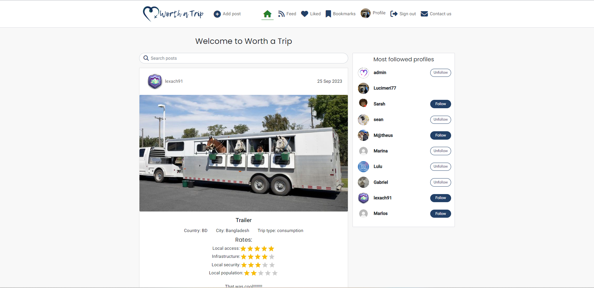 |
| Notbook | 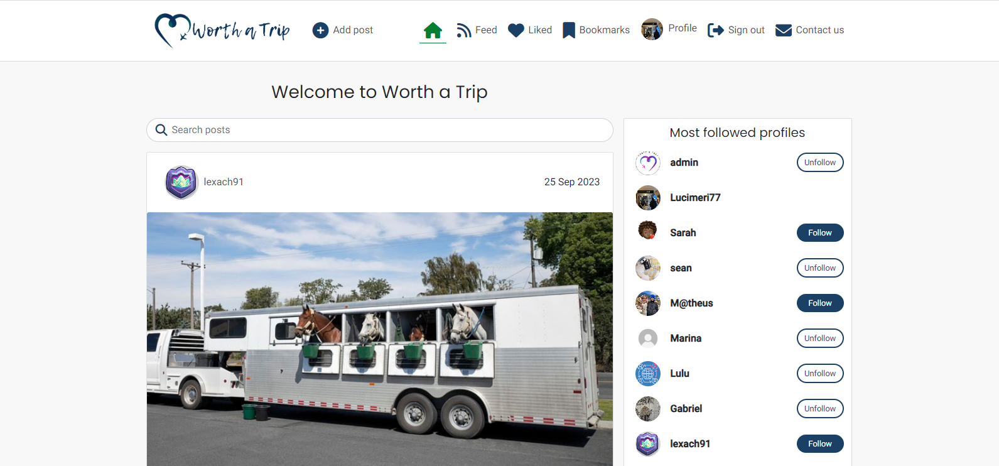 |
| Ipad Air|  |
| Ipad Mini | 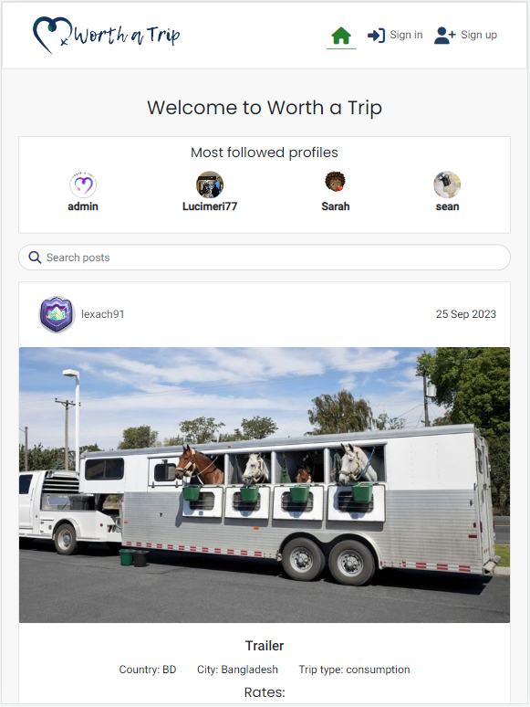 |
| Small Device<br>Dev Tool | 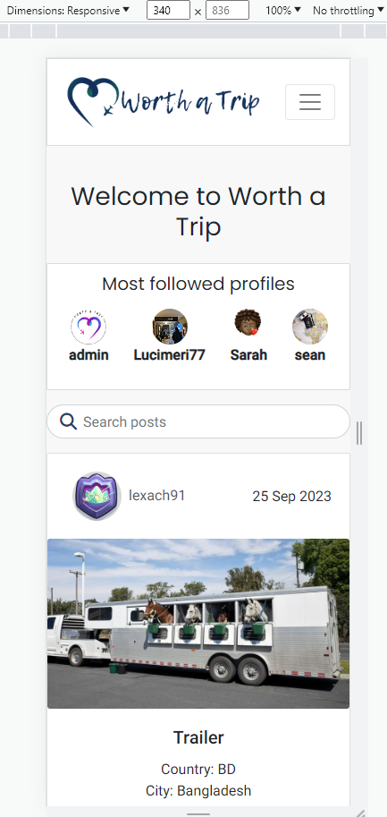 |


The site has been tested through Google's [Mobile friendly test](https://search.google.com/test/mobile-friendly) with all pages passing.

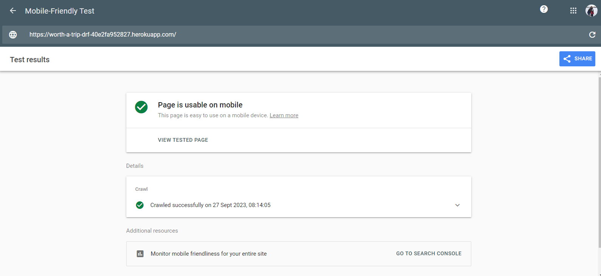

## 👩‍💻 BROWSER COMPABILITY TESTING

The deployed project was tested on multiple browsers to check for compatibility issues and works as expected.

|Browser | Screenshot | 
|:---:|:---: |
| Chrome | 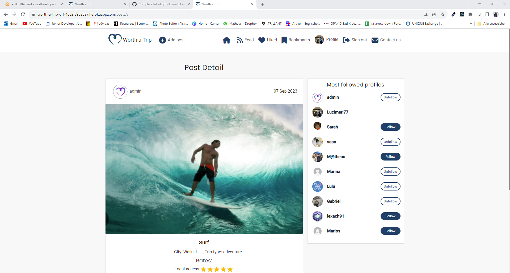  |
| Edge  | 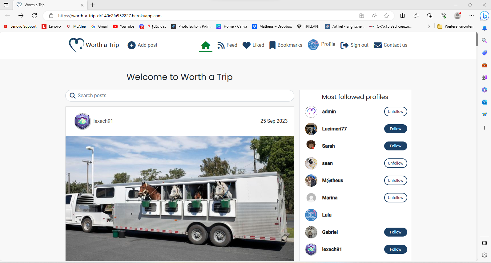  |
| Internet Explorer - Mobile |  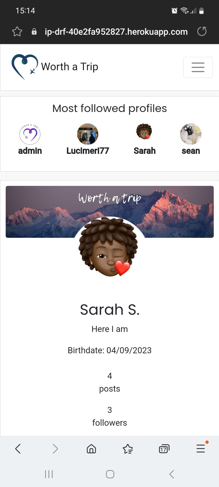  |


## ☠️ BUGS RESOLVED  ☠️

The issues listed in the table below were indentified during the development of the project.

|N.| Issue |  Action | Screenshots | Status | 
|:---|:--- |:--- |:--- | :------- |
|01| After delete slug from Post model raised an error  | Delete migrations and migrate again |  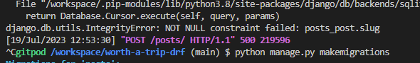 | Closed | 
|02| No such column: profiles_profile.id | Command ``python manage.py migrate profiles zero`` to reset the migrations on the database, then  migrate again | 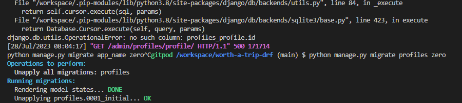 |  Closed | 
| 03 | Placeholder from Password input in the Sign In Form with a comma | Comma was removed from string| 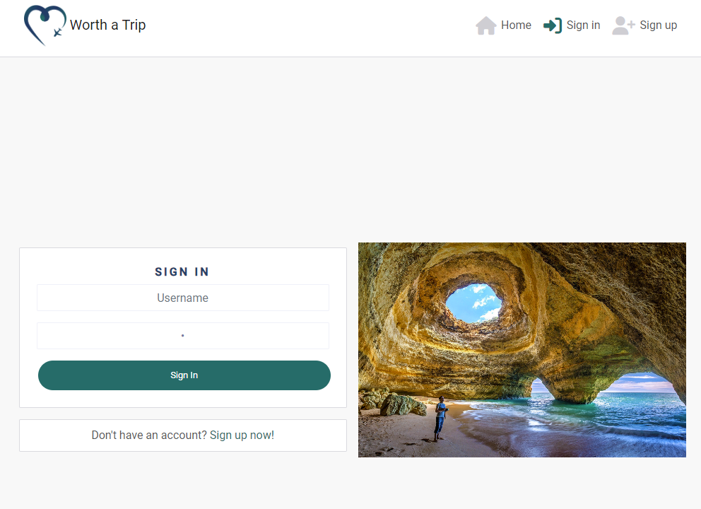 | Closed |
| 04 | Textfield in Edit Post in double in small devices | Adjust bootstrap classes | 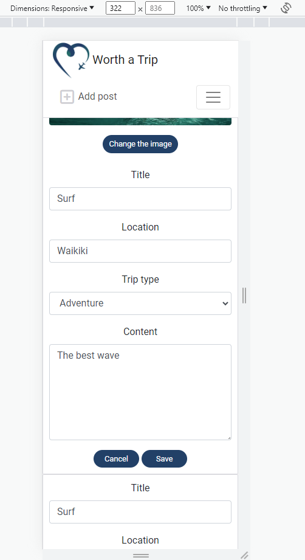 | Closed |
| 05 | 'Unable to resolve dependency tree` installing react-simple-star-rating | Install using `--force` | 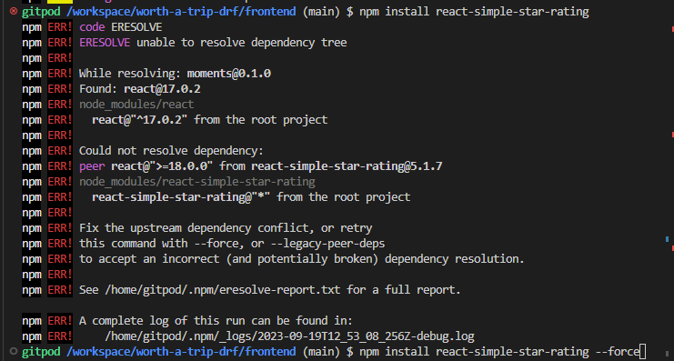 | Closed |
| 06 | Infinite Scroll doesn't work in Gitpod (Gitpod incompatibility) | Test the live version of the application and it works without issues | 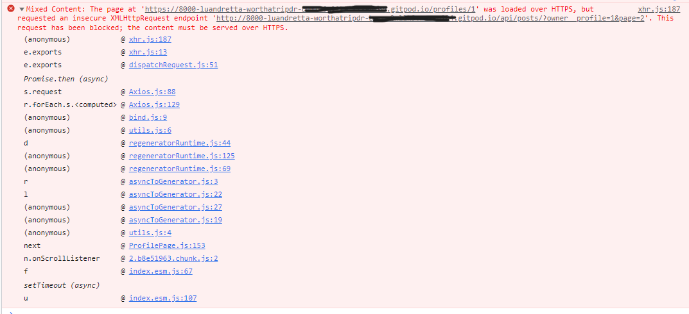 | Closed |


- - -

## 🚦LIGHTHOUSE TESTING OUTCOMES

The deployed project was tested using the Lighthouse Audit tool to check for any major issues. The results for each page are listed bellow. Improvements are needed and will be done in the future.

| Page | Screenshot | 
|:---|:---: |
| Home | 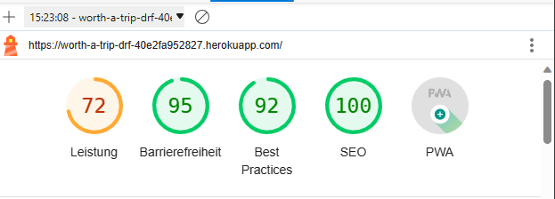 |
| Home (logged in) | 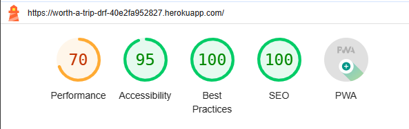 |
| Sign Up | 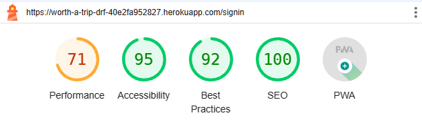 |
| Sign In | 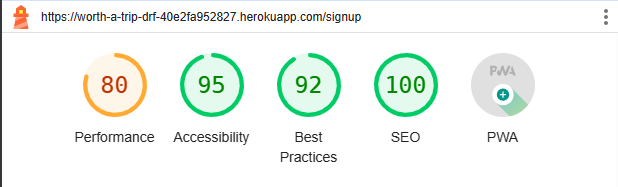 |
| Feed | 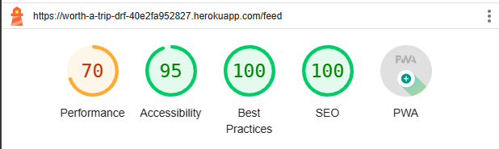 |
| Liked | 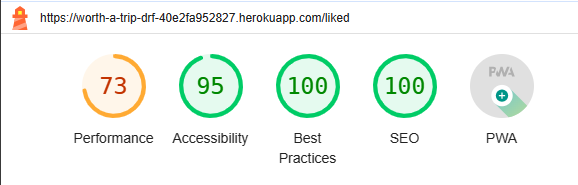 |
| Bookmarks | 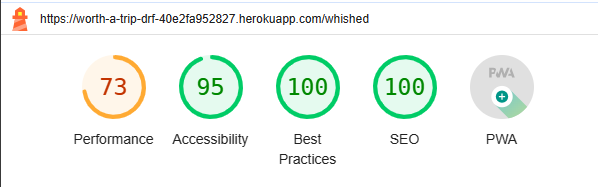 |
| Post Page | 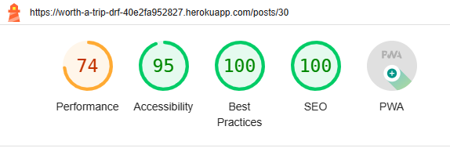 |
| Post Creat | 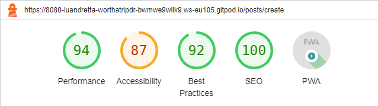 |
| Profile | 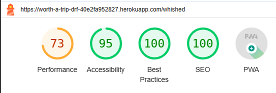 |
| Contact |  |

- - - 

## CODE VALIDATION

### HTML

The [HTML W3C Validator](https://validator.w3.org/) to validate the HTML file.

| File | Screenschot | Status|
|:---|:---: | :---: |
| `index.html`|  | Pass |

The void elements can optionally have a trailing slash and some people prefer to include it as it may look clearer. Some HTML formatters integrated in code editors automatically add a trailing slash to void elements.

## CSS

The [W3C CSS Validator](https://jigsaw.w3.org/css-validator/) was used to validate the project, the results are shown below. 

| Screenschot | Status|
|:---: | :---: |
|  | Pass | 

[CSS Results](https://jigsaw.w3.org/css-validator/validator?uri=https%3A%2F%2Fworth-a-trip-drf-40e2fa952827.herokuapp.com%2F&profile=css3svg&usermedium=all&warning=1&vextwarning=&lang=en)

## JAVASCRIPT

The [JShint Validator](https://jshint.com/) was used to validate the JavaScript file and no errors reported.

| Folder | File  | Status|
|:---|:--- | :---: |
| components |  | |
|  | Asset.js | Pass |
|  | Avatar.js | Pass |
|  | ErrorModal.js | Pass |
|  | MoreDropdown.js | Pass |
|  | NavBar.js | Pass |
|  | NotFound.js | Pass |
| contexts |  | |
|  | CurrentUserContext.js | Pass |
|  | ProfileDataContext.js | Pass |
| mooks |  | |
|  | useClickOutsideToggle.js | Pass |
|  | useRedirect.js | Pass |
| mocks |  | |
|  | handlers.js | Pass |
| pages/auth |  | |
|  | SignInForm.js | Pass |
|  | SignUpForm.js | Pass |
| pages/comments |  | |
|  | Comment.js | Pass |
|  | CommentCreateForm.js | Pass |
|  | CommentEditForm.js | Pass |
| pages/contact |  | |
|  | ContactCreateForm.js | Pass |
| pages/posts |  | |
|  | Post.js | Pass |
|  | PostCreateForm.js | Pass |
|  | PostDelete.js | Pass |
|  | CommentEditForm.js | Pass |
|  | PostPage.js | Pass |
|  | PostsPage.js | Pass |
| pages/profiles |  | |
|  | PopularProfiles.js | Pass |
|  | Profile.js | Pass |
|  | ProfileEditForm.js | Pass |
|  | ProfilePage.js | Pass |
|  | UsernameForm.js | Pass |
|  | UserPasswordForm.js | Pass |
| pages/utils |  | |
|  | utils.js | Pass |
| src |  | |
|  | App.js | Pass |
|  | index.js | Pass |


## PYTHON

The [Code Institute Python Linter](https://pep8ci.herokuapp.com)was used to validate all Python files.

Example from validation using CI Python Linter:

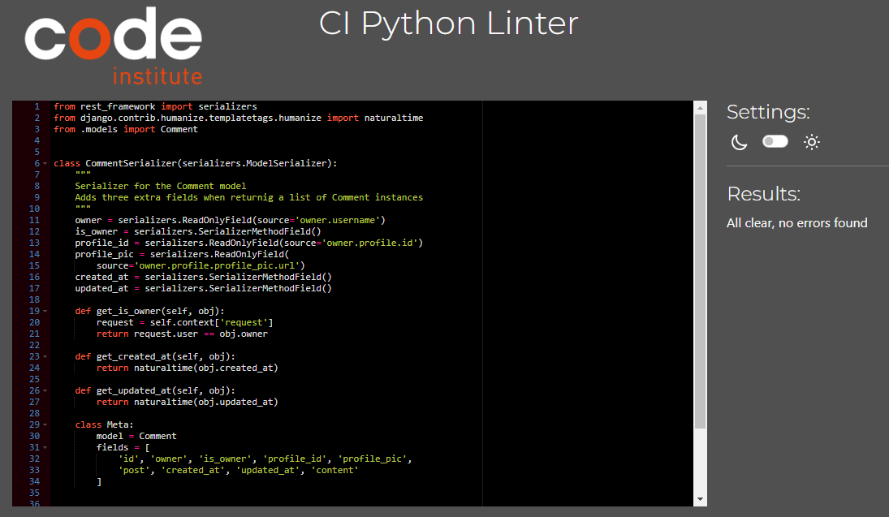

| App/File | admin.py | apps.py | models.py | serializers.py | tests.py | urls.py | views.py | 
|:---|:---: | :---: |:---: | :---: |:---: | :---: |:---: | 
| comments | n/a | n/a | pass | pass | n/a | pass | pass | 
| contact |pass | n/a | pass | pass | n/a | pass | pass | 
| followers | n/a | n/a | pass | pass | n/a | pass | pass | 
| likes | n/a | n/a | pass | pass | n/a | pass | pass |
| posts | pass | n/a | pass | pass | pass | pass | pass |
| profiles | pass | n/a | pass | pass | n/a | pass | pass |
| wishes |  n/a | n/a | pass | pass | n/a | pass | pass |

Note: add a new line at end of the posts/admin.py file to pass

| App/File | asgy.py | permissions.py | serializers.py | settings.py |  urls.py | views.py | wsgi.py |
|:---|:---: | :---: |:---: | :---: |:---: | :---: |:---: | 
| drf_api | pass | pass | pass | pass | pass | pass | pass | 

There are 4 errors due to **AUTH_PASSWORD_VALIDATORS** length.

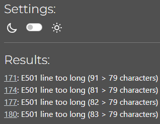

- - - 
## ✔️ USER STORIES TESTING

The implemented User Stories were tested during the development of this project and also after it was finished with the Features Testing described in the next section of tests, which was executed manually.

There are several screenshots in the [README.md](README.md) file in the Features section.

Part of the final tests were recorded: 

https://github.com/luandretta/worth-a-trip-drf/assets/113333171/6a08111d-0b5f-47eb-95f4-bff4a8c4abaa


| Category  | as| I want to | so that I can | UI components  | MoSCow | Status |
| --------- | ----- | -------------- | :----------- | ------| --------- | --- |
| auth | user| register for an account | have a personal profile with a picture| SignUpForm<br>ProfilePage<br>ProfileEditForm | Must Have | pass |
| auth | user | register for an account  | create, like, bookmarkt and comment on posts | Post<br>PostPage<br>Comment | Must Have | pass |
| auth | user | register for an account | follow anothers users | Profile<br>ProfilePage| Should Have | pass |
| posts | visitor | view a list of posts | browse the most recent uploads | PostsPage  | Must Have | pass |
| posts | visitor | view an individual post | see user feedback, i.e. likes and read comments  | Post<br>PostPage | Should Have | pass |
| posts | visitor | search a list of posts | find a post by title or city or triptype| PostsPage | Should Have | pass |
| posts | visitor | scroll through a list of posts | browse the site more comfortably | InfiniteScroll | Could Have | pass |
| posts | user | create a post  | share my trips with others | PostCreateForm | Must Have | pass |
| posts | user| edit and delete my post | correct or hide any mistakes  | PostEditForm<br>MoreDropdownMenu | Must Have | pass |
| posts | user | view liked and bookmarket posts  | go back often to my favourite and desired posts | PostsPage | Should Have | pass |
| posts | user| view followed users' posts | keep up with my favourite users' trips  | PostsPage  | Should Have | pass |
| posts | user| view saved users' posts | go back often to find inpirations for the next trip  | PostsPage  | Must Have | pass |
| likes | user | like a post  | express my interest in someone's shared trip  | Post like icon   | Must Have | pass |
| likes | user| unlike a post | express that my interest in someone's shared trip has faded away | Post (un) like icon | Must Have | pass |
| wishes | user | save a post  | express my interest in someone's shared trip  | Post pin icon   | Could Have | pass |
| wishes | user| unsave a post | express that my interest in someone's shared trip has faded away | Post (un) pin icon | Could Have | pass |
| comments | user | create a comment  | share my thoughts on other people's content | PostPage<br>CommentCreateForm | Should Have | pass |
| comments | user | edit and delete my comment  | correct or hide any mistakes | PostPage<br>Comment<br>MoreDropdownMenu | Should Have | pass |
| profiles | user | view a profile  | see a user's recent posts, followers, following count data | ProfilePage<br>Post  | Must Have | pass |
| profiles | user | edit a profile | update my profile information | ProfileEditForm  | Must Have | pass |
| followers | user | follow a profile | express my interest in someone's content  | Profile follow button | Could Have | pass |
| followers | user | unfollow a profile | express that my interest in someone's content has faded away and remove their posts from my feed | Profile (un) follow button |  Could Have | pass |
| contact | user | get in touch with the website creator | clear up my doubts | Contact | Must Have | pass |

- - -

## ✏️ FEATURES TESTING

The process and outcomes of manual testing to test each feature are described bellow:

| Feature | Page/Status | Element | Action | Expected Result | Status |
| --- | --- | --- | --- | --- | --- |
| **Auth pages** |  |   |   | | |
|  | **Sign up** |  Username input |  click | Allow the user to input alphanumeric characters | pass |
|  |  | Password input | click  | Allow the user to input alphanumeric characters | pass |
|  |  | Confirm Password input | click  | Allow the user to input alphanumeric characters | pass |
|  |  | Check in box | click  | The users confirm that they agree to the terms and conditions of the application and that their data will not be shared | pass |
|  |  | Sign up button | hover  | Change color | pass |
|  |  |   | click  | If valid data: signup user <br>Redirect to the Sing In page<br>Success notification | pass |
|  |  |   | click  | Username field blank: display error notification and message | pass |
|  |  |   | click  | Invalid data(didn't match): display error notification and message | pass |
|  |   | Sign- in link  | click  | Open Sing In Page <br> Change color from icon<br> Only Sing-up link is underlined | pass |
|  | **Sign In** |  Username input |  click | Allow the user to input alphanumeric characters | pass |
|  |  |  Password input | click  | Allow the user to input alphanumeric characters | pass |
|  |  |  Sign in button | hover  | Change color | pass |
|  |  |   | click  | If valid data: signin user <br>Redirect to the home page<br>Success notification | pass |
|  |  |   | click  | Username field blank: display error notification and message | pass |
|  |  |   | click  | Invalid data(didn't match): display error notification and message | pass |
|  |   | Sign- up link  | click  | Open Sing Up Page <br> Change color from icon<br> Only Sing-up link is underlined | pass |
|  | **Sign Out Modal** |  Sign Out link on Navbar |  click | Open sign out confirmation modal | pass |
|  |  |  Modal | click modal close button | Close modal | pass |
|  |  |  | click modal outiside box | Close modal | pass |
|  |  |  Cancel button | hover  | Change color | pass |
|  |  |   | click  | Return to homepage | pass |
|  |  | Sign out button  | hover  | Change color | pass |
|  |  |  | click  | Log user out<br>Go to homepage<br>Success notification | pass |
| **Navigation**  |   |   |   | | |
|  | **Homepage**<br>logged out |  Navbar  icons| hover  | Change color | pass |
|  |   | Logo  | click  | Redirect to homepage | pass |
|  |   | Home link  | click  | Redirect to homepage <br> Change color from icon<br> Only Home link is underlined | pass |
|  |   | Sign-in link  | click  | Open Sing In Page <br> Change color from icon<br> Only Sing-in link is underlined  | pass |
|  |   | Sign- up link  | click  | Open Sing Up Page <br> Change color from icon<br> Only Sing-up link is underlined | pass |
|  |  **Homepage**<br>logged in |  Navbar  icons |  hover | Change color | pass |
|  |   | Logo  | click  | Redirect to homepage  | pass |
|  |   | Home link  | click  | Redirect to homepage <br> Change color from icon<br> Only Home link is underlined | pass |
|  |   |  Feed link | click  | Redirect to Feed Page <br> Change color from icon<br> Only Feed link is underlined | pass |
|  |   | Liked link  | click  | Redirect to Liked Page <br> Change color from icon<br> Only Liked link is underlined | pass |
|  |   | Bookmarks link  | click  | Redirect to Bookmarks Page <br> Change color from icon<br> Only Bookmarks link is underlined | pass |
|  |   | Profile link  |  click | Go to own Profile Page | pass |
|  |   | Profile link  |  display | Display the current users Avatat | pass |
|  |   | Sing out link  | click  | Open sign out confirmation modal | pass |
|  |   | Contact link  | click  | Open the Contact page | pass |
| **Posts Component**  |   |   |   | | |
|  | **Homepage**<br>logged out |  Search bar icon | hover  | Search icon changes color | pass |
|  |   |  Search bar | type keyword  | Loading spinner displayed until results| pass |
|  |   |   |  no-results | Display no results image with text | pass |
|  |   | Post header  | display  | Post owner avatar, username and Post date | pass |
|  |   |  Avatar |  click | Go to owners Profile Page | pass |
|  |   |   | hover  | Text changes color on username | pass |
|  |   | Post picture | hover  |  Pointer cursor | pass |
|  |   |   | click  | Redirect to post detail page | pass |
|  |   | Heart Icon  | hover  | Display message to log in to like posts| pass |
|  |   | Comment Icon  | click  | Redirect to post detail page | pass |
|  |   | Bookmark Icon |  hover | Display message to log in to bookmark posts| pass |
|  |   | Popular Profiles |  display | Display Avatar and username without follow button| pass |
|  | **Post Detail** <br>logged out  | Comments section  | display  | Avatar, comment date and comment | pass |
|  |   |  Avatar (comment) |  click |Redirect to comment owners profile | pass |
|  |   |  no comments  |  | Display no comments message| pass |
|  | **Homepage**<br>logged-in |  Search bar icon | hover  | Search icon changes color | pass |
|  |   |  Search bar | type keyword  | Loading spinner displayed until results| pass |
|  |   |   |  no-results | Display no results image with text | pass |
|  |   | Post header  | display  | Post owner avatar, username and Post date | pass |
|  |   |  Avatar |  click | Go to owners Profile Page | pass |
|  |   |   | hover  | Text changes color on username | pass |
|  |   | Post picture | hover  |  Pointer cursor | pass |
|  |   |   | click  | Redirect to post detail page | pass |
|  |   | Heart Icon  | hover  | If the currently logged-in user is the owner of the post display 'Sorry, you can't like your own posts' text| pass |
|  |   | Heart Icon  | click  | Post saved to Liked list<br>Change the icon to solid and green color<br>count increase by 1<br>displays notification | pass |
|  |   | Solid heart Icon  | click  | Post removed from Liked list<br>Change the icon to regular and blue color<br>Count decrease by 1<br>Displays notification | pass |
|  |   | Comment Icon  | click  | Redirect to post detail page | pass |
|  |   | Bookmark Icon  | hover  | If the currently logged-in user is the owner of the post display 'Sorry, you can't bookmark your own posts' text| pass |
|  |   | Bookmark Icon  | click  | Post saved to Bookmarks<br>Change the icon to solid and green color<br>Count increase by 1<br>Displays notification | pass |
|  |   | Solid bookmark Icon  | click  | Post removed from Bookmarks<br>Change the icon to regular and blue color<br>Count decrease by 1<br>Displays notification | pass |
|  |   | Popular Profiles |  display | Display Avatar, username and follow/unfollow button| pass |
|  | **Post-owner** | Menu  | display  | If the user is the owner of the post display edit/delete menu | pass |
|  |  |   | hover  | Change color to green<br>Pointer cursor | pass |
|  | | Edit icon  | hover  | Change color to green<br>Pointer cursor<br>Add background color | pass |
|  | | Edit icon  |  click | Redirect to Post Edit Page | pass |
|  | | Delete icon  | hover  | Change color to green<br>Pointer cursor<br>Add background color | pass |
|  | | Delete icon  |  click | Redirect to Post Delete Page | pass |
| **Add/Edit Post** |   |   |   | | |
|  | **Add Post Page** | Add a picture  |  click | Opens a computers folder to select an image | pass |
|  |  |  Image selected |  display | Display the selected image with a button to change it | pass |
|  |  |  Change image button | hover  | Change color | pass |
|  |  |   | click  | Opens a computers folder to change another image | pass |
|  |  |  Title | check  | Title must be under 120 characters| pass |
|  |  | Country Select  |  select  | Country is selected | pass |
|  |  |  Trip Type Select | select  | Trip type is selected | pass |
|  |  | Rate  | hover  | Change the color from stars | pass |
|  |  |   | click  | Rate each field | pass |
|  |  | Cancel Button  | hover  | Change color | pass |
|  |  |   | click  | Redirect to homepage | pass |
|  |  | Create Button  | hover  | Change color | pass 
|  |  |   | click  | With valid data: redirect to new post page<br>Success notification | pass |
|  |  |   | click  | All fields required else error notification and specified error on input field | pass |
|  | **Edit Post Page** |  All inputs | display  |  Prepopulated inputs | pass |
|  |  | Change image button  | hover  | Change color | pass |
|  |  |   |  click | Opens computer to select a new image | pass |
|  |  | Image selected  |  display | New image is displayed to upload | pass |
|  |  |  Country select |  select | The new country is selected | pass |
|  |  |  Trip type select |  select | The new trip type is selected | pass |
|  |  | Rating  | click  | The stars change color according to the rate  | pass |
|  |  | Cancel button  |  hover | Change color  | pass |
|  |  |   | click  | Redirect to post detail page | pass |
|  |  | Save button  | hover  | Change color | pass |
|  |  |   | click  | With valid data: redirect to  post page<br>Success notification | pass |
|  |  |   | click | All fields required else error notification and specified error on input field | pass |
|  | **Delete Post Page** | Delete Post Confirmation  | displays  | Message to confirm deletion | pass |
|  |  | Cancel Button  | hover  | Change color | pass |
|  |  |   | click  | Redirect to Post Detail Page | pass |
|  |  | Delete Button  | hover  | Change color to red | pass |
|  |  |   | click  | Redirect to homepage | pass |
|**Profiles**  |  |   |   | | |
|  | **Profile Page** | Avatar | display  | User avatar or default | pass |
|  |  | Menu  |  display | Only if the user is the owner of the profile | pass |
|  |  |   | hover  | Change color | pass |
|  |  |   | click | Display options|pass |
|  | logged-out |  Personal Information |  display | Display data that has already been added by the owner or  only username and defaults pictures | pass |
|  |  | Posts Count  | display  | Display a users total posts count | pass |
|  |  | Followers Count  | display  | Display a users total followers count | pass |
|  |  | Following Count  | display  | Display a users total following count | pass |
|  |  | | | When a user follows a user from the most followed component the following count increments by one | pass|
|  |  | Follow button  |  missing | Visitors cannot follow an user | pass |
|  |  | Users post | display  | If a user has not created a post display No results found text & image| pass |
|  |  |   | display  | Users post using the Post component | pass |
|  | logged-in | Personal Information |  display | Display data that has already been added by the owner or  only username and defaults pictures | pass |
|  |  | Posts Count  | display  | Display a users total posts count | pass |
|  |  |   |   | When a user adds a new post, the users posts count increments by one | pass |
|  |  |   |   | When a user delete post, the users posts count decreases by one | pass |
|  |  | Followers Count  | display  | Display a users total followers count | pass |
|  |  | Following Count  | display  | Display a users total following count | pass |
|  |  | Follow button  |  display | If the user is not the owner of the profile and is not following this user, display a follow button| pass |
|  |  |   | hover  | Change color | pass |
|  |  |  | click | User is followed<br>The users followers count increments by one<br>Button change to unfollow<br>Update database<br>His posts are displayed on the Feed page<br>Success notification | pass |
|  |  | Unfollow button  |  display | If the user is not the owner of the profile and is following another user, display a unfollow button| pass |
|  |  |   | hover  | Change color | pass |
|  |  |  | click | User will not be followed anymore<br>The users followers count decrements by one<br>Button change to follow<br>Update database<br>The unfollowed users posts won't be displayed on Feed page<br>Success notification | pass |
|  |  | Users post | display  | If a user has not created a post display No results found text & image| pass |
|  |  |   | display  | Users post using the Post component | pass |
|  |  | Profile Menu  | hover  | Change color | pass |
|  |  |   | click  | Open Profile Dropdown menu | pass |
|  |  | Edit Profile tab |  hover | Add background color<br>Change color | pass |
|  |  |   | click | Open edit profile page | pass |
|  |  | Change Username tab | hover  |Add background color<br>Change color | pass |
|  |  |   | click  | Open change username page | pass |
|  |  | Change Password tab | hover  |Add background color<br>Change color | pass |
|  |  |   | click  | Open change password page | pass |
|  | **Edit Profile Page** | Form  | display  | Form to edit own profile | pass |
|  |  |  Name input |  click | Allow the user to input alphanumeric characters | pass |
|  |  | Bio input  | click  | Allow the user to input alphanumeric characters | pass |
|  |  | Location input  | click  | Allow the user to input alphanumeric characters | pass |
|  |  | Birthdate  | click  | Click on the input box allow the user to type a valid date | pass |
|  |  |   |   | Click on the calendar allow the user to pick a date | pass |
|  |  | Background button | hover  | Change color | pass |
|  |  |   |  click | Open the computer to change a background picture<br>Display the new background picture | pass |
|  |  | Profile Picture button | hover  | Change color | pass |
|  |  |   |  click | Open the computer to change a profile picture<br>Display the new profile picture | pass |
|  |  | Cancel button  |  hover | Change color  | pass |
|  |  |   | click  | Redirect to profile page | pass |
|  |  | Save button  | hover  | Change color | pass |
|  |  |   | click  | With valid data: redirect to  profile page<br>Success notification | pass |
|  |  |   | click | All fields required else error notification and specified error on input field | pass |
|  | **Change Username** | Change username field   | click  | Clicking the input box allows the user to input alphanumeric characters | pass |
|  |  | Cancel button  |  hover | Change color  | pass |
|  |  |   | click  | Redirect to profile page | pass |
|  |  | Save button  | hover  | Change color | pass |
|  |  |   | click  | With valid data: redirect to  profile page<br>Success notification | pass |
|  |  |   | | If the field is left empty display error notification | pass |
|  |  |   | | If the same username exists display error at input field and error notification | pass |
|  | **Change Password** | New password field   | click  | Clicking the input box allows the user to input alphanumeric characters | pass |
|  |  | Confirm password field   | click  | Clicking the input box allows the user to input alphanumeric characters | pass |
|  |  | Cancel button  |  hover | Change color  | pass |
|  |  |   | click  | Redirect to profile page | pass |
|  |  | Save button  | hover  | Change color | pass |
|  |  |   | click  | With valid data(match both passwords): redirect to  profile page<br>Success notification | pass |
|  |  |   |  | If the field is left empty display error notification | pass |
|  |  |   |  | If the passwords didn't match display error at input field and error notification | pass |
| **Contact**  |  |   |   | | |
|  | **Contact Page** |  Form |  display | Display Enquiry and Message inputs | pass |
|  |  | Enquiry input  | click  | Allow the user to input alphanumeric characters| pass |
|  |  | Message input  |  click | Allow the user to input alphanumeric characters| pass |
|  |  | Cancel button  |  hover | Change color  | pass |
|  |  |   | click  | Redirect to home page | pass |
|  |  | Save button  | hover  | Change color | pass |
|  |  |   | click  | With valid data: redirect to home page<br>Admin receives the message<br>Success notification | pass |
|  |  |   |  | If the field is left empty display error notification and specified error on input field| pass |
|  | **Admin Panel**| Message | display | Receive the new message to get in touch with the user | pass |

There are several screenshots of the features in the [README.md](README.md) file.

- - - 

## AUTOMATED TESTING

The Django's Built-in Unit Testing Framework was used to test the application functionality on the project without errors.
To perform the test the following step was used:
- In the terminal type the command:

```bash
python3 manage.py test
```

The Coverage.py is a tool for measuring code coverage of Python programs. It monitors your program, noting which parts of the code have been executed, then analyzes the source to identify code that could have been executed but was not.

Coverage measurement is typically used to gauge the effectiveness of tests. It can show which parts of your code are being exercised by tests, and which are not.

To install:
```bash
python3 -m pip install coverage
```
Use `coverage run`  to run your test suite and gather data. However you normally run your test suite, you can use your test runner under coverage.

Use `coverage report`  to report on the results and for a nicer presentation, use coverage html to get annotated HTML listings detailing missed lines.

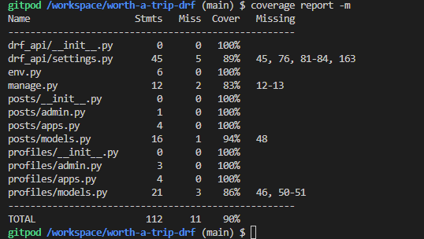

This tool will be used in the future again.

### TEST CASE

#### Backend

A test case were written in the backend to proof the post feature to ensure:
- we can view all objects
- logged in user can create a new Post object and view object
- logged in user cannot access a invalid id
- owner can update his own post
- logged in user cannot update another users post

A creation of a temporary database was needed.

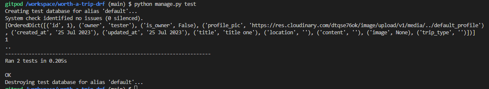

*Note:* new fields were implemented after writing the test, such as country and ratings. 

#### Frontend

The `NavBar` and `NotFound` components were tested via jest unit test in the React app.

The following command is used to run the tests:
```
npm test
```

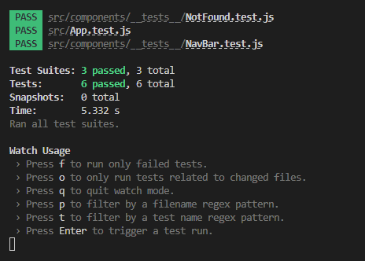

*Note:* the `NavBar.test.js` needs to be rewritten due to the implementation of the sign out modal, which was implemented after this test.

- - -

Return back to the [README.md](README.md) file.
