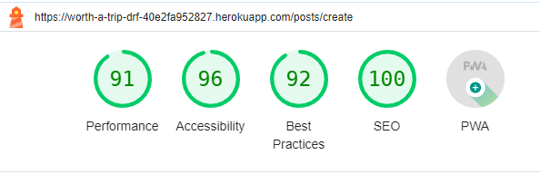
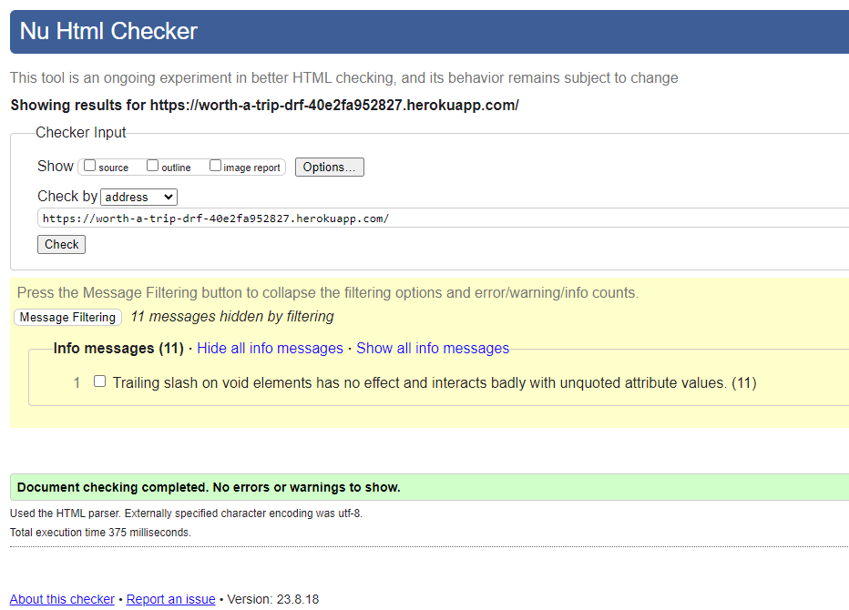

# 🚀 TESTING

For a proper conclusion to this project several tests were performed.

Return back to the [README.md](README.md) file.

## RESPONSIVENESS TESTING

The application was tested on multiple devices to check for responsiveness issues. Used DevTool to test on ipad and small devices.

The bootstrap classes were used to be as responsive as possible and it works as expected according to the wireframes.

| Device | Screenshot |
| :--- | :---: |
| Desktop |  |
| Notbook |  |
| Ipad Air|  |
| Ipad Mini |  |
| Small Devide |  |


## BROWSER COMPABILITY TESTING

The deployed project was tested on multiple browsers to check for compatibility issues and works as expected.

|Browser | Screenshot | 
|:---:|:---: |
| Chrome |   |
| Edge  |   |
| Internet Explorer - Mobile |    |


## ☠️ BUGS RESOLVED AND UNRESOLVED ☠️

The issues listed in the table below were indentified during the development of the project.

|N.| Issue |  Action | Screenshots | Status | 
|:---|:--- |:--- |:--- | :------- |
|01| After delete slug from Post model raised an error  | Delete migrations and migrate again |   | Closed | 
|02| No such column: profiles_profile.id | Command ``python manage.py migrate profiles zero`` to reset the migrations on the database, then  migrate again |  |  Closed | 
| 03 | Placeholder from Password input in the Sign In Form with a comma | Comma was removed from string| ------ | Closed |
| 04 | 

## LIGHTHOUSE TESTING OUTCOMES

The deployed project was tested using the Lighthouse Audit tool to check for any major issues. The results for each page are listed bellow. Improvements are needed and will be done in the future.

| Page | Screenshot | 
|:---|:---: |
| Home |  |
| Home (logged in) |  |
| Sign Up |  |
| Sign In |  |
| Feed |  |
| Liked |  |
| Bookmarks |  |
| Post Page |  |
| Post Creat |  |
| Profile |  |
| Contact |  |

## CODE VALIDATION

### HTML

The [HTML W3C Validator](https://validator.w3.org/) to validate the HTML file.

| File | Screenschot | Status|
|:---|:---: | :---: |
| `index.html`|  | Pass |

The void elements can optionally have a trailing slash and some people prefer to include it as it may look clearer. Some HTML formatters integrated in code editors automatically add a trailing slash to void elements.

## CSS

The [W3C CSS Validator](https://jigsaw.w3.org/css-validator/) was used to validate the project, the results are shown below. 

| Screenschot | Status|
|:---: | :---: |
| []() | Pass | 

[CSS Results](https://jigsaw.w3.org/css-validator/validator?uri=https%3A%2F%2Fworth-a-trip-drf-40e2fa952827.herokuapp.com%2F&profile=css3svg&usermedium=all&warning=1&vextwarning=&lang=en)

## JAVASCRIPT

The [JShint Validator](https://jshint.com/) was used to validate the JavaScript file and no errors reported.

| Folder | File  | Status|
|:---|:--- | :---: |
| components |  | |
|  | Asset.js | Pass |
|  | Avatar.js | Pass |
|  | ErrorModal.js | Pass |
|  | MoreDropdown.js | Pass |
|  | NavBar.js | Pass |
|  | NotFound.js | Pass |
| contexts |  | |
|  | CurrentUserContext.js | Pass |
|  | ProfileDataContext.js | Pass |
| mooks |  | |
|  | useClickOutsideToggle.js | Pass |
|  | useRedirect.js | Pass |
| mocks |  | |
|  | handlers.js | Pass |
| pages/auth |  | |
|  | SignInForm.js | Pass |
|  | SignUpForm.js | Pass |
| pages/comments |  | |
|  | Comment.js | Pass |
|  | CommentCreateForm.js | Pass |
|  | CommentEditForm.js | Pass |
| pages/contact |  | |
|  | ContactCreateForm.js | Pass |
| pages/posts |  | |
|  | Post.js | Pass |
|  | PostCreateForm.js | Pass |
|  | PostDelete.js | Pass |
|  | CommentEditForm.js | Pass |
|  | PostPage.js | Pass |
|  | PostsPage.js | Pass |
| pages/profiles |  | |
|  | PopularProfiles.js | Pass |
|  | Profile.js | Pass |
|  | ProfileEditForm.js | Pass |
|  | ProfilePage.js | Pass |
|  | UsernameForm.js | Pass |
|  | UserPasswordForm.js | Pass |
| pages/utils |  | |
|  | utils.js | Pass |
| src |  | |
|  | App.js | Pass |
|  | index.js | Pass |


## PYTHON

The [Code Institute Python Linter](https://pep8ci.herokuapp.com)was used to validate all Python files.

Example from validation using CI Python Linter:


| App/File | admin.py | apps.py | models.py | serializers.py | tests.py | urls.py | views.py | 
|:---|:---: | :---: |:---: | :---: |:---: | :---: |:---: | 
| comments | n/a | n/a | pass | pass | n/a | pass | pass | 
| contact |pass | n/a | pass | pass | n/a | pass | pass | 
| followers | n/a | n/a | pass | pass | n/a | pass | pass | 
| likes | n/a | n/a | pass | pass | n/a | pass | pass |
| posts | pass | n/a | pass | pass | pass | pass | pass |
| profiles | pass | n/a | pass | pass | n/a | pass | pass |
| wishes |  n/a | n/a | pass | pass | n/a | pass | pass |

Note: add a new line at end of the posts/admin.py file to pass

| App/File | asgy.py | permissions.py | serializers.py | settings.py |  urls.py | views.py | wsgi.py |
|:---|:---: | :---: |:---: | :---: |:---: | :---: |:---: | 
| drf_api | pass | pass | pass | pass | pass | pass | pass | 

There are 4 errors due to **AUTH_PASSWORD_VALIDATORS** length.


## USER STORIES TESTING

## FEATURES TESTING

## AUTOMATED TESTING

The Django's Built-in Unit Testing Framework was used to test the application functionality on the project without errors.
To perform the test the following step was used:
- In the terminal type the command:

```bash
python3 manage.py test
```

The Coverage.py is a tool for measuring code coverage of Python programs. It monitors your program, noting which parts of the code have been executed, then analyzes the source to identify code that could have been executed but was not.

Coverage measurement is typically used to gauge the effectiveness of tests. It can show which parts of your code are being exercised by tests, and which are not.

To install:
```bash
python3 -m pip install coverage
```
Use `coverage run`  to run your test suite and gather data. However you normally run your test suite, you can use your test runner under coverage.

Use `coverage report`  to report on the results and for a nicer presentation, use coverage html to get annotated HTML listings detailing missed lines.


This tool will be used in the future again.

### TEST CASE

#### Backend

A test case were written in the backend to proof the post feature to ensure:
- we can view all objects
- logged in user can create a new Post object and view object
- logged in user cannot access a invalid id
- owner can update his own post
- logged in user cannot update another users post

A creation of a temporary database was needed.


#### Frontend

The `NavBar` and `NotFound` components were tested via jest unit test in the React app.

The following command is used to run the tests:
```
npm test
```


Return back to the [README.md](README.md) file.